---

*Başlamadan önce: kaynağa destek olabilir ve daha çok kişiye erişmesini sağlayabilirsiniz.* 🎉⭐

---

### İçindekiler

1. [Giriş ve Tanışma](#giriş-ve-tanışma)
2. [Nesne Yönelimli Programlama Nedir?](#nesne-yönelimli-programlama-nedir)
   - [Sınıf Hiyerarşileri](#sınıf-hiyerarşileri)
   - [Nesne Yönelimli Programlama İlkeleri](#nesne-yönelimli-programlama-i̇lkeleri)
     - [Abstraction (Soyutlama)](#encapsulation-kapsülleme)
     - [Encapsulation (Kapsülleme)](#abstraction-soyutlama)
     - [Inheritance (Kalıtım)](#inheritance-kalıtım)
     - [Polymorphism (Çok Biçimlilik)](#polymorphism-çok-biçimlilik)
   - [Nesneler Arası İlişkiler](#nesneler-arası-i̇lişkiler)
     - [Inheritance (Kalıtım)](#inheritance)
     - [Implementation](#implementation)
     - [Association (Bağlantı)](#association-bağlantı)
     - [Dependency (Bağımlılık)](#dependency-bağımlılık)
     - [Composition(Bileşim)](#compositionbileşim)
     - [Aggregation(İçerme)](#aggregationi̇çerme)
3. [S.O.L.I.D. Nedir?](#solid-nedir)
   - [Single Responsibility (Tek Sorumluluk Prensibi)](#single-responsibility-principle-tek-sorumluluk-prensibi)
   - [Open/Closed Principle (Açık Kapalı Prensibi)](#openclosed-principle-açık-kapalı-prensibi)
   - [Liskov Substitution (Liskov’un Yerine geçme Prensibi)](#liskov-substitution-principle-liskovun-yerine-geçme-prensibi)
   - [Interface Segregation (Arayüz Ayrımı Prensibi)](#interface-segregation-principle-arayüz-ayrımı-prensibi)
   - [Dependency Inversion (Bağımlılıkların Tersine Çevrilmesi Prensibi)](#dependency-inversion-principle-bağımlılıkların-tersine-çevrilmesi-prensibi)
4. [Tasarım Deseni Nedir?](#tasarım-deseni-nedir)
5. [Tasarım Desenleri](#tasarım-desenleri)
   - [Creational  (Oluşturucu)](#creational-oluşturucu)
     - [Singleton](#-singleton)
     - [Factory](#-factory)
     - [Abstract Factory](#-abstract-factory)
     - [Builder](#%EF%B8%8F-builder)
     - [Prototype](#-prototype)
   - [Structural (Yapısal)](#structural-yapısal)
     - [Adapter](#-adapter)
     - [Bridge](#-bridge)
     - [Composite](#-composite)
     - [Decorator](#-decorator)
     - [Facade](#-facade)
     - [Flyweight](#%EF%B8%8F-flyweight)
     - [Proxy](#-proxy)
   - [Behavioral (Davranışsal)](#behavioral-davranışsal)
     - [Chain of Responsibility](#%EF%B8%8F-chain-of-responsibility)
     - [Command](#-command)
     - [Interpreter](#%EF%B8%8F-interpreter)
     - [Iterator](#%EF%B8%8F-iterator)
     - [Mediator](#-mediator)
     - [Memento](#%EF%B8%8F-memento)
     - [Observer](#-observer)
     - [State](#-state)
     - [Strategy](#-strategy)
     - [Template Method](#-template-method)
     - [Visitor](#%EF%B8%8F-visitor)
6. [Kapanış](#kapan%C4%B1%C5%9F)
7. [Kaynakçalar](#kaynakçalar)

## Giriş ve Tanışma

Merhabalar.👋

Ben Yusuf, K.T.Ü yazılım mühendisliği öğrencisiyim. Oluşturduğum bu kaynak ile; tasarım desenlerini bilmeyen kişiler için öğrenmeyi, bilgisi olan kişiler için de bilgilerini güncel tutacağı ve bir problem olduğunda danışacağı bir başucu kaynağı olmasını hedefliyorum. Bu kaynağın ortaya çıkış amacından da kısaca bahsedecek olursam; çevremdeki insanların, takip ettiğim kişilerin Türkçe kaynak oluşturma konusunda bir çaba içerisinde olduğunu fark ettim. Kimileri blog, haftalık okumalar, bültenler ya da kitap yazarak kimileri de eğitim videoları çekerek. Ben de bu zincire katılarak elimden geldiğince faydalı olmaya çalışmak istedim ve bu kaynağı oluşturmaya karar verdim.

## Nesne Yönelimli Programlama Nedir?

Nesne yönelimli programlama paradigması, gerçek hayatta olan varlıkları yazılım dünyasında modellemekte kullandığımız, her işlevin nesneler olarak soyutlandığı bir programlama yaklaşımıdır. Tıpkı gerçek hayatta olduğu gibi yazılımda da bu sayede nesnelerimizin öznitelikleri, davranışları olacaktır.

Ortaya çıkış nedenlerinden bazıları da yazılımda; karmaşıklığı azaltmaya, bakım maliyetini düşürmeye, modülariteyi artırmaya, nesneler arası hiyerarşiyi kurmaya yaramasıdır.    

### Nesneler, Sınıflar

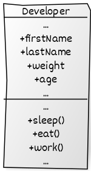

Yukarıda `Developer` adında bir sınıf görülmektedir. <code>Sınıf</code> alanlar (fields) ve davranışlarımızın (methods) tanımlandığı yerdir. <code>Nesne</code> ise bu sınıftan bir örnek alınmış halidir.

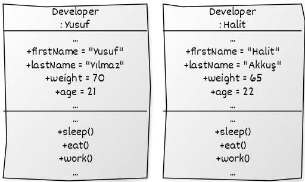

Diyelim ki Yusuf adında bir geliştiriciniz var. Yusuf bir nesne, `Developer` sınıfının bir örneğidir. Her `Developer`'ın birçok standart özelliği vardır: isim, yaş, ağırlık vb. Bunlar sınıfın alanları, öznitelikleridir.

Tüm geliştiriciler de benzer şekilde davranırlar: uyurlar, yerler, kod yazarlar. Bunlar sınıfın davranışlarıdır. Toplu olarak yukarıda da bahsettiğimiz gibi alanlar ve davranışlar sınıflarının üyeleri olarak başvurulabilir.

Bir diğer geliştiriciniz Halit de  `Developer` sınıfının bir örneğidir. Yusuf ile aynı özelliklere sahiptir. Fark bu özelliklerin değerlerinde: isimleri farklı, yaş olarak daha büyük ve daha hafif.

Yani bir sınıf, o sınıfın somut örnekleri olan nesnelerin yapısını tanımlayan bir taslak gibidir.

### Sınıf Hiyerarşileri

Yukarıdaki örnekte bir adet sınıf kullanıldı ama gerçek uygulamalarda bildiğimiz gibi bir sınıftan daha fazlası mevcut. Bunlar arasında bir hiyerarşi, düzen mevcut. Tıpkı gerçek hayatta olduğu gibi.  Biyoloji bunun için en iyi örnektir. İnekler ve kargalar aynı atadan gelirler, bu yüzden inekler ve kargaların ortak noktaları mevcuttur, bunlar; isim, cinsiyet, ayak sayısı gibi niteliklerdir. Kargalar beslenebilir, uyuyabilir ve ineklerin yaptığı gibi koşabilir. Biyolojide de olduğu gibi; yazılımda da bir hiyerarşi kurabilir, ortak nitelikleri ve davranışları listeleyecek temel `Hayvan` sınıfını tanımlayabiliriz.    

Hiyerarşi düzeninde; genel, kapsayıcı sınıfa  <code>superclass</code> (üst sınıf). Bunlardan türeyen sınıflara da <code>subclasses</code> (alt sınıflar) denir. Bu hiyerarşi ile birlikte alt sınıflar, üst sınıfların özelliklerini ve davranışlarını almaktadır. 

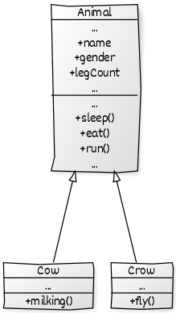

Bahsettiğimiz hiyerarşi yukarıda da gösterilmiştir. <code>Animal</code> adında bir <code>superclass</code> (üst sınıf) ve bunlardan türeyen <code>subclasses</code> (alt sınıflar) mevcut. Bu alt sınıflar, üst sınıfın niteliklerini ve davranışlarını almaktadır. Bu yüzden kendi içlerinde tekrar yazmaya gerek yoktur. Ortak özeliklerin yanı sıra kendilerine has olan özellikler de kendi içlerinde tanımlanmıştır. Örneğin; `Cow` sınıfı içerisinde ineklere özgü olan süt sağma eylemi `milking()` fonksiyonu içerisinde gerçekleştirilmiştir. `Crow` sınıfına özel nitelikler ve davranışlar da kendi içerisinde tanımlanmıştır.

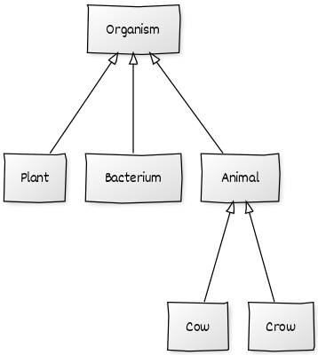

Bazı durumlarda UML diyagramlarında sınıfların barındırdığı nitelik ve davranışlardan ziyade bulunduğu hiyerarşi daha önemlidir, bu tür durumlarda yukarıdaki gibi basit bir tanımlama kullanılmaktadır.

### Nesne Yönelimli Programlama İlkeleri

Nesne yönelimli programlama 4 temel ilke üzerine kuruludur ve bir dilin, nesne yönelimli programlamayı uyguluyor denebilmesi için 4 koşulu da sağlıyor olması gerekiyor. Bunlar; `Encapsulation`, `Abstraction`,  `Inheritance`, `Polymorphism`

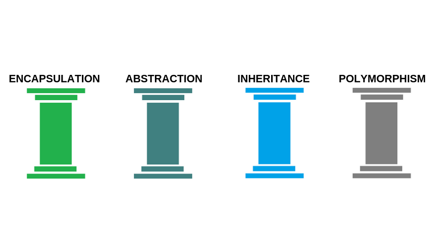

#### Encapsulation (Kapsülleme)

Herhangi bir nesnenin metotlarını, verilerini veya değişkenlerini diğer nesnelerden saklayarak ve bunlara erişimini sınırlandırarak yanlış kullanımlardan koruyan bir konsepttir. Bir nesne üzerinde hem veri soyutlama hem de kontrol soyutlaması yapılıyor ise buna sarma adı verilir. Çoğu programlama dilleri kapsüllemeyi aşağıda sıraladığımız erişim belirteçleri ile desteklerler.

1. **public:** Erişimin her yerden yapılabileceği anlamı taşıyor.

2. **private:** Erişimin tanımlandığı sınıf içerisinden yapılabileceği anlamı taşıyor.

3. **protected:** Sadece tanımlandığı sınıfın içinden veya o sınıftan türetilmiş diğer sınıfların içinden erişilebilir.

#### Abstraction (Soyutlama)

Farklı kod parçalarının kompleks kısımlarını, sahip oldukları ortak davranışlar, amaçlar, karakteristik özellikler arkasında saklamak sayesinde daha anlaşılır ve kolay kullanılabilir kod yazmaktır abstraction.

#### Inheritance (Kalıtım)

Kalıtım, mevcut sınıfların üzerine yeni sınıflar oluşturma yeteneğidir. Bu sayede türetilen sınıf, türediği sınıfın özelliklerini devralır. Kalıtımın en büyük yararı kodun yeniden kullanılmasıdır. Mevcut sınıftan biraz farklı bir sınıf oluşturmak istiyorsak, kodu kopyalamamıza gerek yoktur. Bunun yerine, varolan sınıfı genişletir ve ekstra işlevselliği alt sınıfa koyarız.    

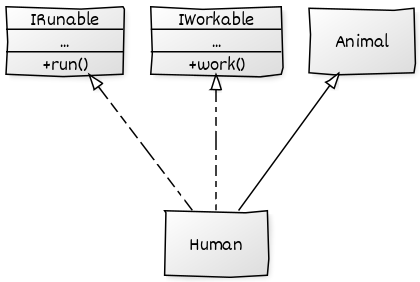

Çoğu programlama dilinde **yalnızca bir sınıftan türetme işlemi gerçekleştirilmektedir** ama birden fazla interface'den (ara birimden) türetilme işlemi de gerçekleştirilebilmektedir. 

#### Polymorphism (Çok Biçimlilik)

Bir nesnenin başka bir nesne gibi davranabilmesi, kullanılabilmesi. Biraz daha açık bir ifade ile: alt sınıfların, üst sınıflara ait olan davranışlarını başka bir biçimde gerçekleştiriyor olması olayıdır. 

    

Yukarıda `ILoggerService` adında bir `Interface` ve içerisinde de `log()` adında metotu bulunmaktadır.  Bu interface'den türetilen `DatabaseLoggerService` ve `FileLoggerService` sınıfları, metotu implement etmek (uygulamak) zorundadır ve kendince uygulayacaktır ki bundan dolayı da bu metota ait farklı davranışlar söz konusu olacaktır.

```java
43    ...
44    ...
45    loggerServices = new ILoggerService[] { 
46      new DatabaseLoggerService(), new FileLoggerService() };
47
48     foreach (ILoggerService loggerService : loggerServices)
49         loggerService.log(data)
50    ...

output: // Logged with database logger
output: // Logged with file logger
```

Nesnenin davranışı çalışma anında belirlendiği için, çok biçimlilik özelliği sayesinde nesnelerin türünü önceden bilmek zorunda kalmayız.

### Nesneler Arası İlişkiler

Bu kısımda kaynağın herkese hitap etmesi açısından temel düzeyde de olsa UML diyagramlarındaki sınıflar arasındaki ilişkilere değiniyor olacağız.

#### Inheritance


Sınıflar arası kalıtımı gösterir. Alt sınıftan üst sınıfa doğru içi boş ok ile gösterilir.

#### Implementation


Arayüzler ile sınıflar arasındaki ilişkiyi gösterir.

#### Association (Bağlantı)


Bir nesnenin başka bir nesneyi kullandığı veya onunla etkileşime girdiği bir ilişki türüdür. Kullanılmak istenen nesneye ok işareti ile refere edilir. **Sınıflar arasında HAS-A ilişkisi bulunuyor.** 

#### Dependency (Bağımlılık)


Genellikle nesneler arasında kalıcı bir bağlantı olmadığını ima eden daha zayıf bir ilişki çeşididir. Bağımlılık genellikle (ancak her zaman değil), bir nesnenin başka bir nesneyi bir parametre olarak kabul ettiğini, başlattığını veya başka bir nesneyi kullandığını gösterir. Sınıflar arasındaki bağımlılığı nasıl tespit edebileceğiniz aşağıda açıklanmıştır: **Bir sınıfın tanımında yapılan değişiklikler başka bir sınıfta değişikliklere neden oluyorsa iki sınıf arasında bir bağımlılık vardır.**

#### Composition (Bileşim)


Bütünlük sağlar, bir sınıf veya sınıfların diğer bir sınıfın parçası olduğu anlamı çıkar. **Parçalar tek başlarına bir anlam taşımazlar**. Yukarıdaki örneğe bakılacağı zaman firma konumlardan oluşmaktadır, ayrılma durumu yoktur, bağımlıdır, konum tek başına bir anlam ifade etmez.

#### Aggregation (İçerme)


Bütünlük sağlar, bir sınıf veya sınıfların diğer bir sınıfın parçası olduğu anlamı çıkar. **Parçalar tek başlarına bir anlam taşıyabilirler**. Yukarıdaki örneğe bakılacağı zaman havalimanı uçakları içerir, ayrılma durumu olabilir, sıkı sıkıya bağımlılık yoktur, uçak tek başına bir anlam ifade edebilir.

## S.O.L.I.D. Nedir?

> S.O.L.I.D., yazılım geliştirirken sürdürülebilir kod yazmamızı sağlayan bir prensipler bütünüdür. 

Buradaki sürdürülebilirlikten kasıt; yazılım gereksinimleri değiştiğinde ya da mevcut yazılıma eklemeler yapıldığında sistemin buna direnç göstermemesi, en azından en az direnci göstermesi, yani esnek olmasıdır. Bunların yanı sıra bakımının ve anlaşılmasının kolay olması gibi nedenler de sayılabilir.

Bunları yapmamızı sağlayan prensipleri 5 madde içerisinde inceleyeceğiz.

### Single Responsibility Principle (Tek Sorumluluk Prensibi)

> Her sınıf, metot, fonksiyon tek bir sorumluluğa sahip olmalıdır.

Şayet bu kurala uymazsak ilerleyen süreçte bir değişikliğe gidildiğinde bunun etkisini birçok yerde görmüş oluruz. Nedeni ise bir yapıya birden fazla sorumluluk yüklenmesinden dolayıdır. Eğer değişikliklerden etkilenen yerler arasında sistemin birçok yerinde kullanılan bir yapımız da varsa maliyet gittikçe artacaktır.   

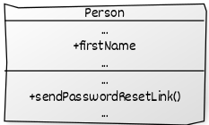

JAVA Kod Örneği:

```java
public class Person {
    public String firstName;

    public void sendPasswordResetLink() {
        ...
    }
}
```

Yukarıdaki diyagrama ve koda baktığımızda `Person` sınıfı içerisinde `sendPasswordResetLink()` diye bir metot bulunmaktadır. Bu sınıfın asıl amacı kişilere ait bilgileri tutmaktır, şifre sıfırlama bağlantısı göndermek değil. Birden fazla sorumluluk yüklendiği için olası bir mail gönderme değişikliğinde bu sınıf da etkilenecektir.

Yukarıdaki UML diyagramını biraz daha düzenlersek aşağıdaki gibi bir yapı elde edilir.

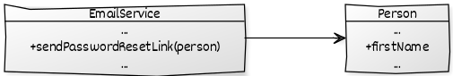

JAVA Kod Örneği:

```java
class Person {
     public String firstName;
}

class EmailService {
    public void sendPasswordResetLink(Person person) {
        ...
    }
}
```

### Open/Closed Principle (Açık Kapalı Prensibi)

> Yapılarımız (sınıf, metot, fonksiyon) gelişime açık değişime kapalı olmalıdır.

Yazılımlar için zamanla değişim şüphesiz kaçınılmazdır; değişen iş kuralları, kullanılan harici kütüphaneler gibi başlıca nedenler örnek gösterilebilir. Bu prensibin anlatmak istediği şey **yeni bir davranış ya da özellik eklemek istediğimiz durumda; yapmak istediğimiz değişikliği mevcut koda dokunmadan, değişimi sadece yeni kodlar üzerinden sağlamaktır.**

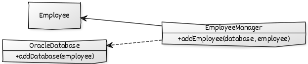

JAVA Kod Örneği:

```java
class Employee {
    ...
}

class EmployeeManager {
    public void addEmployee(Object database, Employee employee) {
        if (database instanceof OracleDatabase) {
            ((OracleDatabase) database).addDatabase(employee);
        }
    }
}

class OracleDatabase {
    public void addDatabase(Employee employee) {
        ...
    }
}
```

Yukarıdaki koda ve diyagrama baktığımız zaman `EmployeeManager` adında bir sınıfımız mevcut ve gelen `Employee` sınıfına ait nesneyi veri tabanına kayıt ediyor. Veri tabanına kayıt etmeden önce hangi veri tabanı örneği geldiğini de `if-else` durumlarında kontrol edip tip dönüşümü sağlamaktadır. Yukarıdaki kod örneği maalesef `Open-Closed` için uygun değildir. Nedeni ise yeni bir veri tabanı eklenmek istediğinde başka bir `if-else` durumu açılacaktır, yeni eklenen veri tabanı kontrolü sağlanacaktır ve sürekli mevcut koda bir müdahalede bulunulacaktır. **Bunu çözmenin yolu ise genelde soyutlamadan geçmektedir.**

Yukarıdaki UML diyagramını biraz daha düzenlersek aşağıdaki gibi bir yapı elde edilir. Yeni bir eklemede mevcut koda dokunmaya gerek kalmıyor bu sayede. Kayıt işlemlerini `MySQL` üzerinde yapmak istediğimiz zaman `MySQLDatabase` adında bir sınıf oluşturup `IDatabase` arayüzünü uygulamamız yeterlidir. 🥰

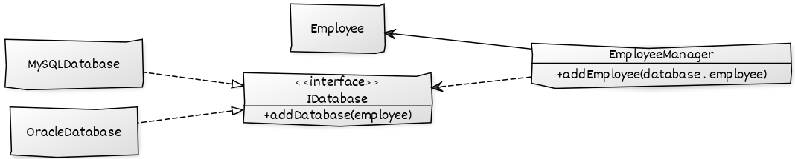

JAVA Kod Örneği:

```java
class Employee { 
...
}

interface IDatabase {
    void addDatabase(Employee employee);
}

class EmployeeManager {
    public void addEmployee(IDatabase database, Employee employee) {
        database.addDatabase(employee);
    }
}

class OracleDatabase implements IDatabase {
    @Override
    public void addDatabase(Employee employee) {
       ...
    }
}
```

### Liskov Substitution Principle (Liskov’un Yerine Geçme Prensibi)

> Alt sınıflardan oluşan nesnelerin, üst sınıfın nesneleri ile yer değiştirdiklerinde aynı davranışı sergilemesi gerekmektedir.

Alt sınıflar, üst sınıflardan türediği için onların davranışlarını devralırlar. Eğer üst sınıflara ait davranışları gerçekleştirmiyorlarsa davranışı yapan metotu muhtemelen boş bırakır ya da bir hata fırlatırız fakat bu işlemler kod kirliliğine ve gereksiz kod kalabalığına neden olmaktadır. Bunların yanı sıra projeye daha sonradan dahil olacak geliştiriciler için de sorun oluşturmaktadır. Geliştirici, sistemin sağlıklı yürüdüğünü düşünerek gerçekleştirilmeyen bir davranışı kullanmaya çalışabilir.

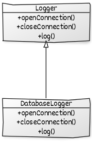

Java Kod Örneği:

```java
abstract class Logger {
    public abstract void openConnection();
    public abstract void closeConnection();
    public abstract void log();
}
```

```java
class DatabaseLogger extends Logger {
    @Override
    public void openConnection() {
        ...
    }

    @Override
    public void closeConnection() {
        ...
    }

    @Override
    public void log() {
        openConnection();
        // LOG
        closeConnection();
    }
}
```

yukarıdaki koda baktığımız zaman `DatabaseLogger` sınıfımız, `Logger` adlı sınıftan türemektedir. Başlangıç aşaması için bir problem görünmezken ilerleyen zamanlarda veri tabanı değil de bir dosyaya kayıt işlemi alınacağı zaman aşağıdaki gibi bir görünüm meydana gelecektir.

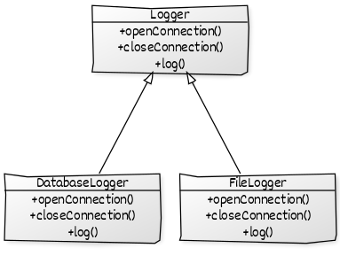

```java
class FileLogger extends Logger {
    @Override
    public void openConnection() {
        new Exception("Not implemented!");
    }

    @Override
    public void closeConnection() {
        new Exception("Not implemented!");
    }

    @Override
    public void log() {
        // LOG
    }
}
```

bağlantı açma ve kapatma işlemleri veri tabanına aittir, bir dosyaya değil. Gereksiz hata fırlatmaları, kodun okunmasındaki zorluk, kod kalabalığı gibi birçok olaya neden olmaktadır. Burada bu işlemler bir ara sınıfa alınabilir.

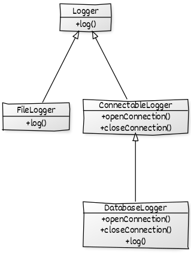

```java
abstract class Logger {
    public abstract void log();
}
```

```java
abstract class ConnectableLogger extends Logger {
    public abstract void openConnection();
    public abstract void closeConnection();
}
```

```java
class FileLogger extends Logger {
    @Override
    public void log() {
        // LOG
    }
}
```

```java
class DatabaseLogger extends ConnectableLogger {
    @Override
    public void openConnection() {
        ...
    }

    @Override
    public void closeConnection() {
        ...
    }

    @Override
    public void log() {
        openConnection();
        // LOG
        closeConnection();
    }
}
```

### Interface Segregation Principle (Arayüz Ayrımı Prensibi)

> Sınıflar, kullanmadığı metotları içeren arayüzleri uygulamaya zorlanmamalıdır. 

Arayüzlerimizde genel olarak birçok operasyonel işlem barındırabiliriz fakat bu arayüzü uygulayan sınıfların, bazılarını kullanmama durumu olabilmektedir. **Bir sınıf birden fazla arayüzü uygulaması özelliğiyle de birlikte bu prensip, bu tür durumlarda arayüzlerin ayrılmasını ve ihtiyaç halinde olanların kullanmasını söylemektedir**. 

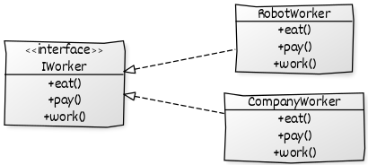

JAVA Kod Örneği:

```java
interface IWorker {
    void eat() throws Exception;

    void work();

    void pay() throws Exception;
}
```

```java
class RobotWorker implements IWorker {

    @Override
    public void eat() throws Exception {
        throw new Exception();
    }

    @Override
    public void pay() throws Exception {
        throw new Exception();
    }

    @Override
    public void work() {
      ...
    }
}
```

Yukarıdaki diyagram incelendiğinde, şirket çalışanları `IWorker` arayüzünü uygulamaktadır; yemek yeme, ödeme alma, çalışma gibi davranışları gerçekleştirmektedir. Fakat daha sonradan bazı işler robotlar tarafından yapılmaya başlandı ya da dış kaynaktan birileri (outsource) de çalışmaya başladı. Bu durumda bazı davranışlar gerçekleşmeyecektir. Örneğin robotların yemek yeme ya da ödeme alma davranışını gerçekleştirememesi gibi ya da dış kaynaktan gelenlere verilmeyen yemek imkanı. Bu gerçekleşmeyen davranışların içlerini ya boş bırakma ya da hata fırlatma durumunda kalırız. **Bu tür durumlarda bu prensip bizlere bu arayüzlerin ayrılmasını ve ihtiyaç halinde olanların kullanılmasını söylemektedir.**

Yukarıdaki UML diyagramını biraz daha düzenlersek aşağıdaki gibi bir yapı elde edilir. `work()`, `pay()`, `eat()` davranışları başka arayüzlere aktarıldı ve ihtiyaç halinde olanlar uygulandı.

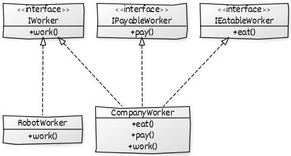

JAVA Kod Örneği:

```java
interface IWorker {
    void work();
}
```

```java
interface IEatableWorker {
    void eat();
}
```

```java
interface IPayableWorker {
    void pay();
}
```

```java
class Worker implements IWorker, IEatableWorker, IPayableWorker {

    @Override
    public void eat() {
        ...
    }

    @Override
    public void work() {
        ...
    }

    @Override
    public void pay() {
        ...
    }
}
```

```java
class RobotWorker implements IWorker {
    @Override

    public void work() {
     ...
    }
}
```

### Dependency Inversion Principle (Bağımlılıkların Tersine Çevrilmesi Prensibi)

> Yüksek seviye sınıflar, düşük seviye sınıflara bağlı olmamalıdır. Her ikisi de soyutlamalara bağlı olmalıdır.
> 
> Soyutlamalar, detaylara bağlı olmamalıdır.  Detaylar, soyutlamalara bağlı olmalıdır.

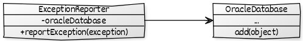

JAVA Kod Örneği:

```java
class ExceptionReporter {
    private OracleDatabase oracleDatabase;

    public ExceptionReporter() {
        oracleDatabase = new OracleDatabase();
    }

    public void reportException(Exception exception) {
        oracleDatabase.add(exception);
    }
}

class OracleDatabase {
    public void add(Object object) {
        System.out.println("added :D");
    }
}
```

Yukarıdaki diyagram ve kod incelendiğinde `ExceptionReporter`  sınıfının (yüksek seviyeli sınıf), `OracleDatabase` sınıfına (düşük seviyeli sınıf) direkt olarak bağımlı olduğu görülmektedir. İleride veri tabanı olarak Oracle değil de MySQL kullanmak istersek maalesef bu sınıfa müdahale etmek zorunda kalacağız. Bu istenmeyen bir davranıştır. Bunun çözümünü ise buradaki **bağımlılıkları soyutlayarak** sağlayacağız.

Yukarıdaki UML diyagramını biraz daha düzenlersek aşağıdaki gibi bir yapı elde edilir.

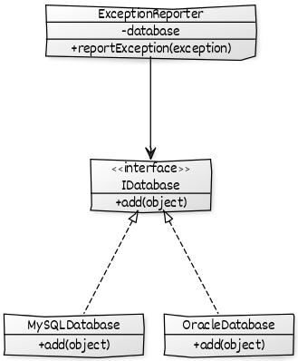

```java
class ExceptionReporter {
    private IDatabase database;

    public ExceptionReporter(IDatabase database) {
        this.database = database;
    }

    public void reportException(Exception exception) {
        database.add(exception);
    }
}

interface IDatabase {
    void add(Object object);
}

class MySQLDatabase implements IDatabase {
    @Override
    public void add(Object object) {
        ...
    }
}

class OracleDatabase implements IDatabase {
    @Override

    public void add(Object object) {
        ...
    }
}
```

## Tasarım Deseni Nedir?

Tasarım desenleri; yazılım tasarımında, problemlerde karşımıza sıkça çıkan ortak sorunları çözmek için oluşturulmuş desenlerdir. Tasarım desenleri, yazılım sürecinde uygulanan çözümlerin esnekliği ve tekrar kullanılabilirliği ile de ilgilenmektedir.

*Her desen, çevremizde tekrar tekrar ortaya çıkan bir sorunu açıklar ve daha sonra bu soruna çözümün uygulanmasını, bu çözümü iki kez aynı şekilde yapmadan milyonlarca kez kullanabileceğiniz şekilde tanımlar.*

—Christopher Alexander

## Tasarım Desenleri

### Creational (Oluşturucu)

> Oluşturucu tasarım desenleri, bir nesnenin ya da grubun esnek ve tekrar kullanılabilir biçimde nasıl oluşturucağı ile ilgilenir.

- [Singleton](#-singleton)
- [Factory](#-factory)
- [Abstract Factory](#-abstract-factory)
- [Builder](#%EF%B8%8F-builder)
- [Prototype](#-prototype)

#### 💎 Singleton

> Bir sınıfın sadece bir örneği olmalıdır ve bu örneğe global bir erişim noktası sağlanmalıdır.

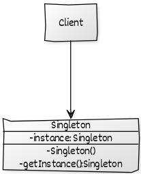

Desene ait yukarıdaki diyagrama bakacak olursak, örneğini istediğimiz sınıfın;

1. Constructor (oluşturucu metotu) `private `olmalıdır. Bunun amacı nesne oluşumunu tek yerden sağlamak. İstemcinin, `new` anahtar kelimesini kullanması engellemektir.
2. `Static bir değişken` olmalıdır, referansı tutmak için.
3. Tutulan referansa erişmek için bir metot olmalıdır, `getInstance()`

C# Kod Örneği:

```csharp
class Database
{
    private static Database database;

    private Database()
    {

    }

    public static Database GetInstance()
    {
        if (database == null)
        {
            database = new Database();
        }

        return database;
    }
}
```

```csharp
Database firstInstanceRequest = Database.GetInstance();
Database secondInstanceRequest = Database.GetInstance();

firstInstanceRequest == secondInstanceRequest // true
```

Desenin yukarıdaki durumu geçerli gibi duruyor fakat multi-thread uygulamalarda nesnenin daha örneğinin oluşmadığı esnada `if (database == null)` durumuna aynı anda birden fazla thread girebilir, bu sayede de o sınıfa ait birden fazla nesne örneği bulunur. Bu kısmı iyileştirme yolunda dillerin bize sağladığı yapıları kullanabiliriz. C# dilinde `lock` ile JAVA dili için de `synchronized` sayesinde aynı anda sadece bir yapının erişmesini sağlarız. 

C# dili için `GetInstance()` metotunu düzenleyecek olursak aşağıdaki hali alacaktır.

```csharp
public class Database
{
    private static Database database;
    private static Object _lockObject = new object();
    
    private Database()
    {

    }

    public static Database GetInstance()
    {
        if (database == null)
        {
            lock (_lockObject)
            {
                if (database == null)
                {
                    database = new Database();
                }
            }
        }

        return database;
    }
}
```

  *Bu tasarım deseninin JAVA ve diğer diller için olan uygulamasını [bu tasarım deseni için oluşturulmuş klasörde](https://github.com/yusufyilmazfr/tasarim-desenleri-turkce-kaynak/tree/master/singleton) bulabilirsiniz.*

#### 🏭 Factory

> Factory tasarım deseni birbirleri ile ilişkili nesneleri oluşturmak için bir arayüz sağlar ve alt sınıfların hangi sınıfın örneğini oluşturacağına olanak sağlar. 

Buradaki amaç istemci tarafından birbirleri ile ilişkili nesnelerin oluşturulma anını soyutlamak, **istemci hangi sınıf örneğini alabileceğini bilebilir ama oluşturulma detayları bilmez**. Detaylar yani nesnenin nasıl oluşturulacağı soyutlanır. Örneğin oluşturulan sınıfın `Singleton` olarak oluşturulması gibi.

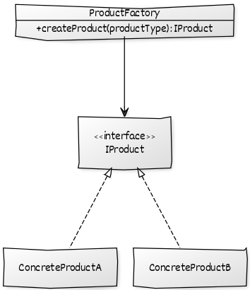

C# Kod Örneği:

```csharp
public class User
{
    // Burada bildirimin gideceği kullanıcıya
    // ait bilgiler bulunacaktır.
}
```

```csharp
// UML diyagramındaki IProduct arayüzümüze denk gelmektedir.
// İlişkili sınıflarımız bu arayüzü uygulayacaktır.
interface INotify
{
    void SendNotification(User user);
}
```

```csharp
// UML diyagramındaki ConcreteProduct sınıflarına denk gelmektedir.
class MailNotify : INotify
{
    public void SendNotification(User user)
    {
        // Mail gönderme operasyonu.
    }
}
```

```csharp
// UML diyagramındaki ConcreteProduct sınıflarına denk gelmektedir.
public class SmsNotify : INotify
{
    public void SendNotification(User user)
    {
        // SMS gönderme operasyonu.
    }
}
```

```csharp
// UML diyagramındaki ProductFactory sınıfına denk gelmektedir.
class NotifyFactory
{
    public INotify CreateNotify(string notifyType)
    {
        if (notifyType == "SMS")
        {
            // Buradaki nesne oluşturma süreçleri bize kalmıştır.
            // Kullanıcıdan soyutlanmıştır.
            // Örnek olarak burası Singleton olarak da ayarlanabilirdi.
            return new SmsNotify();
        }
        else if (notifyType == "MAIL")
        {
            // Buradaki nesne oluşturma süreçleri bize kalmıştır.
            // Kullanıcıdan soyutlanmıştır.
            // Örnek olarak burası Singleton olarak da ayarlanabilirdi.
            return new MailNotify();
        }
        return null;
    }
}
```

```csharp
NotifyFactory notifyFactory = new NotifyFactory();

INotify notify = notifyFactory.CreateNotify("MAIL");

notify.SendNotification(new User());
```

Yukarıdaki kodda da görüldüğü gibi `INotify` arayüzünü uygulayan sınıfların oluşturulması istemciden soyutlanmıştır.

*Bu tasarım deseninin JAVA ve diğer diller için olan uygulamasını [bu tasarım deseni için oluşturulmuş klasörde](https://github.com/yusufyilmazfr/tasarim-desenleri-turkce-kaynak/tree/master/factory) bulabilirsiniz.*

#### 🏭🏭 Abstract Factory

> Abstract Factory tasarım deseni birbirleri ile ilişkili ürün ailesini oluşturmak için bir arayüz sağlar.

Factory tasarım deseninde bir ürünün oluşturulması soyutlanmış iken Abstract Factory deseninde birbirleri ile ilişkili ürün ailelerininin oluşturulması soyutlanmıştır. **Factory üreten Factory deseni olarak da düşünülebilir.** 🧐

Anlayacağımız; birden fazla ürün ailesi ile çalışmak zorunda kaldığımız durumlarda, istemciyi bu yapılardan soyutlamak için Abstract Factory doğru bir yaklaşım olacaktır.

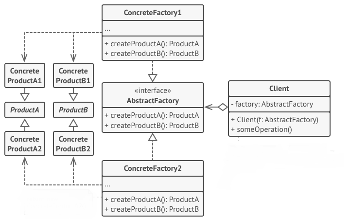

**ProductA**, **ProductB**: Temel sınıflarımız, soyuttur ve oluşturulmasını istediğimiz sınıflar bunlardan türer.

**ConcreteProduct**: Üretmek istediğimiz sınıflardır.

**AbstractFactory**: Herbir sınıfın oluşturulması için metotların tanımlandığı arayüzdür.

**ConcreteFactory**: `AbstractFactory` arayüzünü uygulayarak gerekli sınıfların oluşturulmasını sağlar.

Şöyle bir senaryo düşünülebilir; sistemimiz isteğe bağlı Oracle ya da MySQL için sorgu çalıştırabilir olsun. Bu işlemler için temel olarak da bağlantının açılması, kapatılması ve sorgunun çalıştırılması gerekli olduğu varsayalım.  Bu işlemler direkt olarak herbiri Factory desen olarak ayarlanabilir ama birbirleri ile ilişkili aileden geldikleri için bu desene daha sağlıklı olacaktır. 

C# Kod Örneği:

```csharp
// Soyut sınıfımızdır.
// UML'deki Product sınıfına denk gelmektedir.
public abstract class Command
{
    public abstract void ExecuteCommand(string query);
}
```

```csharp
// Command sınıfından türer.
// UML'deki ConcreteProduct sınıfına denk gelmektedir.
class MySQLCommand : Command
{
    public override void ExecuteCommand(string query)
    {
        // Gelen sorgunun çalıştırılması için
        // Gerekli operasyonel işlemler...
    }
}
```

```csharp
// Command sınıfından türer.
// UML'deki ConcreteProduct sınıfına denk gelmektedir.
class OracleCommand : Command
{
    public override void ExecuteCommand(string query)
    {
        // Gelen sorgunun çalıştırılması için
        // Gerekli operasyonel işlemler...
    }
}
```

```csharp
// Soyut sınıfımızdır.
// UML'deki Product sınıfına denk gelmektedir.
abstract class Connection
{
    public abstract bool OpenConnection();
    public abstract bool CloseConnection();
}
```

```csharp
// Connection sınıfından türer.
// UML'deki ConcreteProduct sınıfına denk gelmektedir.
class MySQLConnection : Connection
{
    public override bool OpenConnection()
    {
        // MySQL veri tabanı bağlantısının açılması için
        // Gerekli operasyonel işlemler...
        return true;
    }
    public override bool CloseConnection()
    {
        // MySQL veri tabanı bağlantısının kapatılması için
        // Gerekli operasyonel işlemler...
        return true;
    }
}
```

```csharp
// Connection sınıfından türer.
// UML'deki ConcreteProduct sınıfına denk gelmektedir.
class OracleConnection : Connection
{
    public override bool OpenConnection()
    {
        // Oracle veri tabanı bağlantısının açılması için
        // Gerekli operasyonel işlemler...
        return true;
    }
    public override bool CloseConnection()
    {
        // Oracle veri tabanı bağlantısının kapatılması için
        // Gerekli operasyonel işlemler...
        return true;
    }
}
```

```csharp
// Oluşturulacak ürünlere ait metotları içerir.
// UML'deki AbstractFactory sınıfına denk gelmektedir.
interface IDatabaseFactory
{
    Connection CreateConnection();
    Command CreateCommand();
}
```

```csharp
// Oracle için ilişkili nesneler üretildi.
// UML'deki ConcreteFactory sınıfına denk gelmektedir.
class OracleDatabaseFactory : IDatabaseFactory
{
    public Command CreateCommand()
    {
        return new OracleCommand();
    }
    public Connection CreateConnection()
    {
        return new OracleConnection();
    }
}
```

```csharp
// MySQL için ilişkili nesneler üretildi.
// UML'deki ConcreteFactory sınıfına denk gelmektedir.
class MySQLDatabaseFactory : IDatabaseFactory
{
    public Command CreateCommand()
    {
        return new MySQLCommand();
    }

    public Connection CreateConnection()
    {
        return new MySQLConnection();
    }
}
```

```csharp
// IDatabaseFactory arayüzünü uygulayan sınıfları
// Kullanarak temel operasyonel işlemleri yapan bir sınıf.
class CustomOperation
{
    IDatabaseFactory _databaseFactory;
    Connection _connection;
    Command _command;

    public CustomOperation(IDatabaseFactory databaseFactory)
    {
        _databaseFactory = databaseFactory;
        _command = databaseFactory.CreateCommand();
        _connection = databaseFactory.CreateConnection();
    }

    public void RemoveById(int id)
    {
        _connection.OpenConnection();
        _command.ExecuteCommand("DELETE ...");
        _connection.CloseConnection();
    }
}
```

```csharp
CustomOperation customOperation = new CustomOperation(new OracleDatabaseFactory());
customOperation.RemoveById(1);
```

*Bu tasarım deseninin JAVA ve diğer diller için olan uygulamasını [bu tasarım deseni için oluşturulmuş klasörde](https://github.com/yusufyilmazfr/tasarim-desenleri-turkce-kaynak/tree/master/abstract-factory) bulabilirsiniz.*

#### ⛏️ Builder

> Builder deseni, karmaşık yapıdaki nesnelerin oluşturulmasında istemcinin sadece nesne tipini belirterek üretimi gerçekleştirebilmesini sağlamak için kullanılan bir desendir. Bu desende istemcinin kullanmak istediği gerçek ürünün birden fazla sunumunun olduğu durumlarda kullanılır.

Builder deseni birden fazla parçadan oluşan kompleks yapıdaki bir nesnenin oluşturulmasını ve bu kompleks nesnenin oluşturulma safhalarını istemci modülünden tamamen gizlemek için kullanılır. Kompleks nesnenin yaratılması istemci modülünden tamamen yalıtıldığı için nesnenin yaratılması ile ilgili işlemler farklı versiyonlarda tamamen değiştirilebilir. Bu durum, istemci programın çalışmasını hiç bir şekilde
etkilemeyecektir.

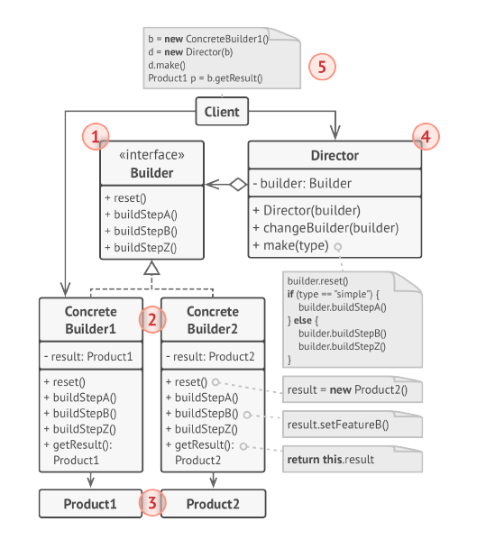

                        *Bu diyagram refactoring.guru üzerinden alınmıştır*.

**Builder:** Product nesnesinin oluşturulması için gerekli soyut arayüzü sunar.

**ConcreteBuilder:** Product nesnesini oluşturur. Product ile ilişkili temel özellikleri de uygular.

**Director:** Builder arayüzünü kullanarak nesne örneklemesini yapar.

**Product:** Üretim sonucu ortaya çıkan nesneyi temsil eder. Dahili yapısı(örneğin temel özellikleri) ConcreteBuilder tarafından inşa edilir.

Senaryo olarak da online bir eğitim platformunun ilk defa eğitim alacak olan öğrencilere ilk eğitimini yarı fiyatına verdiği düşünülsün.

C# Kod Örneği:

```csharp
// UML diyagramındaki Product sınıfına denk gelmektedir.
// Farklı sunumları olan sınıfımız budur.
class Lesson
{
    public int id;
    public string name;
    public string price;
    public string discountedPrice;
    public bool discountApplied;
    public string lessonNote;
}
```

```csharp
// UML diyagramındaki Product'a denk gelen Lesson sınıfıa ait nesnenin oluşturulması için soyut arayüz sağlar.
// Yapılması gereken adımlar içerisinde tanımlıdır.
abstract class LessonBuilder
{
    public Lesson lesson;

    public abstract void GetLesson();
    public abstract void ApplyDiscount();
    public abstract void AddLessonNote();
    public abstract Lesson GetResult();
}
```

```csharp
// LessonBuilder sınıfından türer ve orada tanımlı adımları gerçekleştirir.
// UML diyagramındaki ConcreteBuilder sınıfına denk gelmektedir.
class NewStudentLessonBuilder : LessonBuilder
{
    // Burada nesne çağırma işlemleri gerçekleştirilmektedir.
    // Nasıl çağrılacağı tamamen geliştiriciye kalmıştır.
    // Çıktıyı görmek amacıyla 1-2 değer ataması yapılacaktır.
    public override void GetLesson()
    {
        lesson = new Lesson();
        lesson.id = 1;
        lesson.name = "Artificial Intelligence -  Beginner to Advanced in 10 Minute.";
        lesson.price = 49.99;
    }

    // Burada yeni öğrenciler için geçerli derste %50'lik bir indirim mevcut.
    public override void ApplyDiscount()
    {
        lesson.discountedPrice = lesson.price * 0.5;
        lesson.discountApplied = true;
    }

    public override void AddLessonNote()
    {
        lesson.lessonNote = "Hey, welcome. Your discount code has been applied!";
    }

    public override Lesson GetResult()
    {
        return lesson;
    }
}
```

```csharp
// LessonBuilder sınıfından türer ve orada tanımlı adımları gerçekleştirir.
// UML diyagramındaki ConcreteBuilder sınıfına denk gelmektedir.
class OldStudentLessonBuilder : LessonBuilder
{
    // Burada nesne çağırma işlemleri gerçekleştirilmektedir.
    // Nasıl çağrılacağı tamamen geliştiriciye kalmıştır.
    // Çıktıyı görmek amacıyla 1-2 değer ataması yapılacaktır.
    public override void GetLesson()
    {
        lesson = new Lesson();
        lesson.id = 1;
        lesson.name = "Artificial Intelligence -  Beginner to Advanced in 10 Minute.";
        lesson.price = 49.99;
    }

    // Burada eski öğrenciler için geçerli derste herhangi bir indirim yapılmadı.
    public override void ApplyDiscount()
    {
        lesson.discountedPrice = lesson.price;
        lesson.discountApplied = false;
    }

    public override void AddLessonNote()
    {
        lesson.lessonNote = "";
    }

    public override Lesson GetResult()
    {
        return lesson;
    }
}
```

```csharp
// Builder arayüzünü kullanarak nesne örneklemesi yapar.
// UML diyagramındaki Director'a denk gelmektedir.
class LessonDirector
{
    private LessonBuilder lessonBuilder;

    public LessonDirector(LessonBuilder lessonBuilder)
    {
        this.lessonBuilder = lessonBuilder;
    }

    public void Make()
    {
        lessonBuilder.GetLesson();
        lessonBuilder.ApplyDiscount();
        lessonBuilder.AddLessonNote();
    }
}
```

```csharp
LessonBuilder lessonBuilder = new NewStudentLessonBuilder();

LessonDirector lessonDirector = new LessonDirector(lessonBuilder);
lessonDirector.Make();

Lesson lesson = lessonBuilder.GetResult();

Console.WriteLine($"{lesson.name} - {lesson.price} - {lesson.discountedPrice}");
// output: Artificial Intelligence -  Beginner to Advanced in 10 Minute. - 49,99 - 24,995
```

*Bu tasarım deseninin JAVA ve diğer diller için olan uygulamasını [bu tasarım deseni için oluşturulmuş klasörde](https://github.com/yusufyilmazfr/tasarim-desenleri-turkce-kaynak/tree/master/builder) bulabilirsiniz.*

#### 🐑 Prototype

> Prototype tasarım deseni, mevcut nesnelerin prototiplerinin oluşturulmasını yani nesnelerin kopyalarını elde etmeyi sağlayan bir tasarım desenidir.

Prototip deseninin tasarlanmasının asıl sebebi, ilgili nesne üzerinden aynı tipte başka bir nesneyi hızlıca üretebilmektir. Haliyle üretimi esnasında maliyetli olabilecek nesneleri(ki burada maliyetten kasıt parametreli constructer vs. olabilir) var olan nesne üzerinden `new` anahtar sözcüğünü kullanmadan bir şekilde oluşturulmasını sağlayabilmektedir.

`Shallow Copy` ve `Deep Copy` olmak üzere iki tür nesne kopyalama işlemi mevcuttur.

`Shallow Copy` ile nesnelerin bellekteki adresleri kopyalanmaktadır, dolayısıyla yüzeysel olarak bir kopyalama işlemi gerçekleştirileceği için yeni bir nesne üretilmemekte, var olan nesne üzerine referanslar ile işaretleme yapılmaktadır. Bundan dolayı **Shallow Copy, Prototype Design Pattern için uygun tercih olmayacaktır.**

`Deep Copy` ile nesneler birebir kopyalanabilmekte ve bu kopya sonucu ile asıl nesne farklı referanslar ile işaretlenebilmektedir. Prototype Design Pattern’de bu kopyalama yaklaşımında bulunmak en doğrusudur.

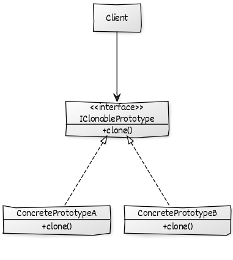

JAVA Kod Örneği:

```java
// Klonlamak istediğimiz sınıflarımıza uygulayacağımız arayüz.
// Farklı sınıflarda da kullanılması için Generic bir yapı oluşturuldu.
// Generic yapı sayesinde dinamik olarak tip dönüşümü sağlanacaktır.
// Bu sayede farklı sınıflara da bu deseni uygulama şansı doğuyor.
interface IClonablePrototype<TPrototype> extends Cloneable {
    TPrototype clone() throws CloneNotSupportedException;
}
```

```java
// Employee sınıfına klonlama yeteneği kazandırmak için tanımladığımız
// arayüzü uyguladık.
public class Employee implements IClonablePrototype<Employee> {
    String firstName;
    String lastName;

    public Employee(String firstName, String lastName) {
        this.firstName = firstName;
        this.lastName = lastName;
    }

    @Override
    public Employee clone() throws CloneNotSupportedException {
        return (Employee) super.clone();
    }
}
```

```java
Employee gulizar = new Employee("Gülizar", "Yılmaz");

Employee cloneGulizar = gulizar.clone();


// Aynı nesne örneklerini farklı referanslarda tutuyor.
// Birbirinin aynısı ve farklı referanslarda olan nesneler elde ettik.
System.out.println(gulizar == cloneGulizar); //output: false
```

---

C# Kod Örneği:

```csharp
// Klonlamak istediğimiz sınıflarımıza uygulayacağımız arayüz.
// Farklı sınıflarda da kullanılması için Generic bir yapı oluşturuldu.
// Generic yapı sayesinde dinamik olarak tip dönüşümü sağlanacaktır.
// Bu sayede farklı sınıflara da bu deseni uygulama şansı doğuyor.
interface IClonablePrototype<TPrototype>
{
    TPrototype Clone();
}
```

```csharp
// Employee sınıfına klonlama yeteneği kazandırmak için tanımladığımız 
// arayüzü uyguladık.

class Employee : IClonablePrototype<Employee>
{
    string firstName;
    string lastName;

    public Employee(string firstName, string lastName)
    {
        this.firstName = firstName;
        this.lastName = lastName;
    }

    public Employee Clone()
    {
        return base.MemberwiseClone() as Employee;
    }
}
```

```csharp
Employee gulizar = new Employee("Gülizar", "Yılmaz");
Employee cloneGulizar = gulizar.Clone();

// Aynı nesne örneklerini farklı referanslarda tutuyor.
// Birbirinin aynısı ve farklı referanslarda olan nesneler elde ettik.
Console.WriteLine(gulizar == cloneGulizar); //output: false
```

*Bu tasarım deseninin diğer diller için olan uygulamasını [bu tasarım deseni için oluşturulmuş klasörde](https://github.com/yusufyilmazfr/tasarim-desenleri-turkce-kaynak/tree/master/prototype) bulabilirsiniz.*

### Structural (Yapısal)

> Yapısal tasarım desenleri, nesnelerin birbirleriyle yapısal olarak nasıl birleşecekleri üzerine durur.

- [Adapter](#-adapter)
- [Bridge](#-bridge)
- [Composite](#-composite)
- [Decorator](#-decorator)
- [Facade](#-facade)
- [Flyweight](#%EF%B8%8F-flyweight)
- [Proxy](#-proxy)

#### 🔌 Adapter

> Bir sınıfın arayüzünü istemcinin beklediği arayüze çevirmeye yarar.

Farklı sistemleri kendi sistemimize dahil ederken bazen yapılar uyuşmayabiliyor. Buradaki yapılar arayüzler olabilir. Bu desenin amacı arayüz için bir adapter oluşturarak sanki kendi sistemimize aitmiş gibi çalıştırmayı sağlar. Özetle; **uyumsuz bir yapıyı, istemcinin beklediği bir yapıya getirir.**

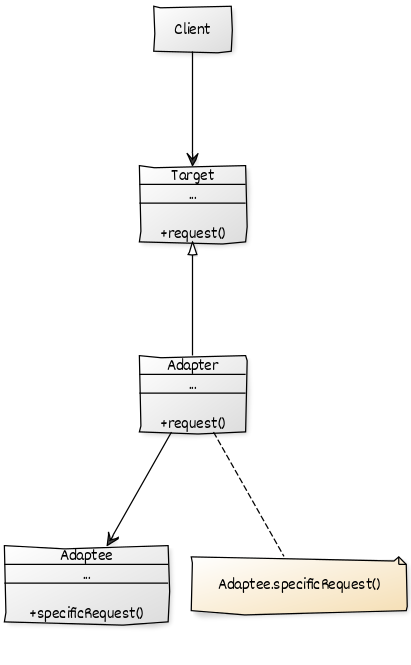

- **Adaptee:** Mevcut sisteme uygulanmak istenen sınıf.

- **Adapter:** Mevcut sisteme uygulama işlemini yapan sınıf.

- **Target:** Sistemde kullanılan yapı. (Abstract, Interface vs.)

Geliştirdiğimiz uygulamada JSON işlemleri için sistemimizin `IJsonSerializer` arayüzünü kullandığını düşünelim. İlerleyen süreçte bu işlemleri gerçekleştirmek için 3. parti bir yazılım kullanmak istediniz  fakat daha sonradan eklediğiniz yapı sisteminiz ile uyumsuz çünkü sistem `IJsonSerializer` arayüzünü uyguluyor fakat yeni gelen yapı bunu uygulamamaktadır ve yeni gelen yapıya da müdahalede bulunamıyorsunuz. Bu sorunu adapter ile aşağıdaki gibi çözüme götürebiliriz.

C# Kod Örneği:

```csharp
// UML diyagramındaki Target'a denk gelmektedir.
// Sistem bu arayüzü uygulayarak çalışmaktadır.
interface IJsonSerializer
{
    public string SerializeObject(object obj);
}
```

```csharp
// Sisteme daha sonradan dahil olan yapı.
// Sistemin kullandığı arayüzü uygulamamaktadır.
// UML diyagramındaki Adaptee'ye denk gelmektedir.
class CustomSerializer
{
    public string Serialize(object obj)
    {
        // Gelen nesneyi serilize etmek için temel operasyonel işlemler..
        // Daha sonradan da gerekli değerin geri döndürülmesi...
        return "serialized with CustomSerializer";

    }
}
```

```csharp
// Daha sonradan dahil edilen yapının sisteme adepte edilmesi işlemi.
// Sistemin kullandığı arayüzü uygular.
// Bu sayede IJsonSerializer'i uygulayan bir sınıf örneği istendiğinde
// bu sınıf örneğini vererek mevcut koda dokunmadan sistemin devam etmesi
// sağlaır.
// UML diyagramındaki Adapter'a denk gelmektedir.
class CustomSerializerAdapter : IJsonSerializer
{
    public string SerializeObject(object obj)
    {
        CustomSerializer customSerializer = new CustomSerializer();
        return customSerializer.Serialize(obj);
    }
}
```

```csharp
class CustomOperation
{
    private IJsonSerializer _jsonSerializer;

    public CustomOperation(IJsonSerializer jsonSerializer)
    {
        _jsonSerializer = jsonSerializer;
    }

    public string SerializeObject(object obj)
    {
        return _jsonSerializer.SerializeObject(obj);
    }
}
```

```csharp
var customOperation = new CustomOperation(new CustomSerializerAdapter());

string serializedObject = customOperation.SerializeObject(new object());

Console.WriteLine(serializedObject); // output: serialized with CustomSerializer
```

*Bu tasarım deseninin JAVA ve diğer diller için olan uygulamasını [bu tasarım deseni için oluşturulmuş klasörde](https://github.com/yusufyilmazfr/tasarim-desenleri-turkce-kaynak/tree/master/adapter) bulabilirsiniz.*

#### 🌉 Bridge

> Bridge tasarım deseni, soyutlanmış (abstract) yapıyı implementasyonundan (uygulamasından) ayırmaya, bağımsız olarak geliştirilebilir iki yapı elde etmemize yarar. 

İstemci kodunu, implementasyonundan ayırmak için soyutlamayı kullanır ve genel olarak da kalıtımdan yararlanmaktayız. Bu işlemleri gerçekleştirirken de bir arayüz veya soyut bir sınıf tanımlarız ve ondan miras hiyerarşileri yaratırız. Her ne kadar ilk bakışta bu yaklaşım mantıklı görünse de ve yanlış bir şey olmasa da, miras yoluyla soyutlamalar her zaman esnek değildir. Kalıtım kullandığımızda, uygulamayı kalıcı olarak soyutlamaya bağlarız. Sonuç olarak, birinde yapılan herhangi bir değişiklik diğerini etkiler. Buradaki daha esnek bir yol, soyutlamayı ve uygulamayı ayırmaktır ve bridge tasarım deseni bu noktada devreye girer. 

Senaryo olarak kullanıcıların metin veya e-posta mesajı gibi farklı türde mesajlar göndermek için kullanabileceği bir mesajlaşma uygulamasını düşünelim. Sezgisel olarak  `Mesaj` adında temel bir interface ya da abstract class oluşturmak ardından da sınıfları bunlardan türetmek gerekiyor. Türetilmiş sınıflarımız; `TextMessage`  ve `EmailMessage` olacaktır. Son olarak da e-posta ve metin mesajını gönderme senaryolarını yapacağımız için `TextMessage` sınıfından türeyen bir `TextMessageSender` ve `EmailMessage` sınıfından türeyen `EmailMessageSender`  sınıflarını oluştururduk. Oluşturacağımız yapı aşağıdaki gibi olacaktır.

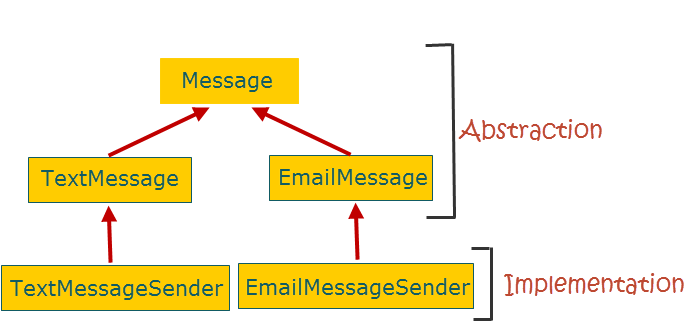

Yukarıdaki tasarımı baktığımız zaman  tasarımımız kalıtım üzerine kuruludur ve doğası gereği bir dezavantajı da kapsüllemeyi kırmasıdır.

Bunun yanı sıra `TextMessage` ya da `EmailMessage` gibi yapılarda oluşacak herhangi bir değişiklik `TextMessageSender` veya `EmailMessageSender` gibi sınıfları etkilemektedir. Birbirinden bağımsız yapılar değil.  

Tekrar kullanılabilirlik açısından da olumsuz bir yana sahiptir. Mesaj gönderme işlemlerini başka bir projede kullanmak istediğimizde bu işlemleri gerçekleştiren sınıfların türediği sınıfları da beraberinde götürmemiz gerekcektir.

Bridge tasarım deseni burada abstraction ve implementation kısmını ayırarak birbirinden bağımsız geliştirilebilir yapılar elde etmemizi sağlar.

Aşağıda Bridge tasarım desenine ait diyagram görülmektedir.

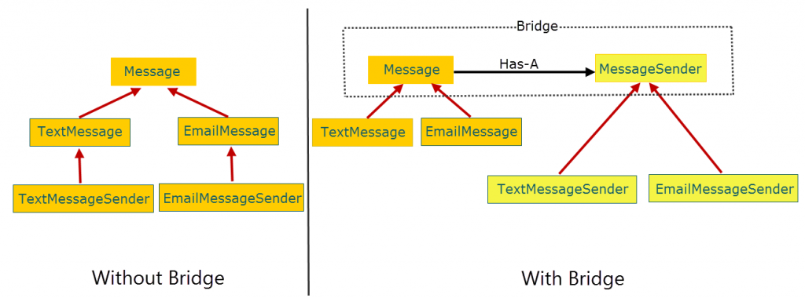

Yukarıdaki desene bakarak özetleyecek olursak:

- **Abstraction (Message):** Implementor (MessageSender) arayüzünü barındırır ve bu arayüzü uygulayan sınıfların metotlarını çağırmak için kullanılır.

- **RefinedAbstraction (TextMessage, EmailMessage):** Soyutlamayı uygulayan ya da onlardan türeyen sınıflardır.

- **Implementor (MessageSender):** İmplementasyonları gerçekleştiren sınıfların uyguladığı arayüzdür. Abstract (Message) sınıf tarafından referansı tutulur.

- **ConcreteImplementor(TextMessageSender, EmailMessageSender):** Implementor (MessageSender) arayüzünu uygulayan, gerçek işi yapan sınıflardır.

Verilen diyagrama ait kod örneği aşağıdaki gibi olacaktır.

C# Kod Örneği:

```csharp
// UML diyagramındaki Abstraction kısmına denk gelmektedir.
// Implementor (IMessageSender) arayüzünün referansını tutmaktadır.
public abstract class Message
{
    protected IMessageSender messageSender;

    public Message(IMessageSender messageSender)
    {
        this.messageSender = messageSender;
    }

    public abstract void Send();
}
```

```csharp
// UML diyagramındaki RefinedAbstraction kısmına denk gelmektedir.
// Abstraction (Message) sınıfından türer.
public class EmailMessage : Message
{
    public EmailMessage(IMessageSender messageSender) : base(messageSender)
    {
    }

    public override void Send()
    {
        messageSender.SendMessage(this);
    }
}
```

```csharp
// UML diyagramındaki RefinedAbstraction kısmına denk gelmektedir.
// Abstraction (Message) sınıfından türer.
public class TextMessage : Message
{
    public TextMessage(IMessageSender messageSender) : base(messageSender)
    {
    }

    public override void Send()
    {
        messageSender.SendMessage(this);
    }
}
```

```csharp
// UML diyagramındaki Implementor (IMessageSender) arayüzünen denk gelmektedir.
// Abstraction (Message) tarafından referansı tutulur ve haberleşme burası ile gerçekleşir.
public interface IMessageSender
{
    void SendMessage(Message message);
}
```

```csharp
// UML diyagramındaki ConcreteImplementor (TextMessageSender) kısmına denk gelmektedir.
// Implementor arayüzünü (IMessageSender) uygular.
public class TextMessageSender : IMessageSender
{
    public void SendMessage(Message message)
    {
        Console.WriteLine("TextMessageSender: Sending text message...");
    }
}
```

```csharp
// UML diyagramındaki ConcreteImplementor (EmailMessageSender) kısmına denk gelmektedir.
// Implementor arayüzünü (IMessageSender) uygular.
public class EmailMessageSender : IMessageSender
{
    public void SendMessage(Message message)
    {
        Console.WriteLine("EmailMessageSender: Sending email message...");
    }
}
```

```csharp
IMessageSender textMessageSender = new TextMessageSender();
Message textMessage = new TextMessage(textMessageSender);
textMessage.Send(); // output: TextMessageSender: Sending text message...

IMessageSender emailMessageSender = new EmailMessageSender();
Message emailMessage = new EmailMessage(emailMessageSender);
emailMessage.Send(); // output: EmailMessageSender: Sending email message...
```

*Bu tasarım deseninin JAVA ve diğer diller için olan uygulamasını [bu tasarım deseni için oluşturulmuş klasörde](https://github.com/yusufyilmazfr/tasarim-desenleri-turkce-kaynak/tree/master/bridge) bulabilirsiniz.*

#### 🌲 Composite

> Composite tasarım deseni, nesneleri ağaç yapısına göre düzenleyerek ağaç yapısındaki alt üst ilişkisini kurmaya yarayan bir desendir.

Bu tasarım deseninin amacının nesneleri ağaç yapısına göre düzenleyerek,
ağaç yapısındaki alt üst ilişkisini kurmak olduğunu söyledik. Burada ağacın herbir yapısı ortak bir arayüzü uygular. Ortak arayüzü uygulamasının sebebi ise birbirine benzer yapılar ile çalışıyor olmak bu benzerlik bizlere esnek bir yapı sunacaktır. 

Aşağıda bu desene ait UML diyagramı yer almaktadır.

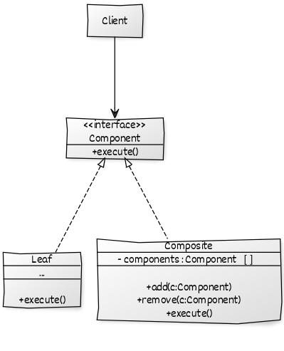

- **Client:** İstemci sınıf.

- **Component:** Soyut yapımızdır, özellikler içerisinde tanımlıdır ve diğer sınıflar bu yapıyı uygular.

- **Composite:** Alt öğeleri olan sınıfımızdır, `Component`'in somut halidir ve içerisinde Component listesi tutmaktadır.

- **Leaf:** Ağaç yapısındaki en alt elemanı temsil etmektedir.

Senaryo olarak iç içe geçmiş kategorileri ve kategorilerin en altında bulunan ürünleri düşünebiliriz. 

C# Kod Örneği:

```csharp
// Soyut yapımızdır.
// UML diyagramındaki Component kısmına denk gelmektedir.
// Diğer istemci sınıflar bu yapıyı uygular.
// Diğer sınıfların uygulayacağı hiyerarşiyi çizme metotunu içermektedir.
public interface ICatalogComponent
{
    void DrawHierarchy();
}
```

```csharp
// Somut yapımızdır.
// UML diyagramındaki Composite kısmına denk gelmektedir.
// Component (ICatalogComponent) listesi tutmaktadır.
public class ProductCatalog : ICatalogComponent
{
    private string _name;

    private List<ICatalogComponent> _components;

    public ProductCatalog(string name)
    {
        _name = name;
        _components = new List<ICatalogComponent>();
    }

    public void Add(ICatalogComponent catalogComponent)
    {
        _components.Add(catalogComponent);
    }

    public void Remove(ICatalogComponent catalogComponent)
    {
        _components.Remove(catalogComponent);
    }

    public void DrawHierarchy()
    {
        Console.WriteLine(_name);
        foreach (ICatalogComponent component in _components)
        {
            component.DrawHierarchy();
        }
    }
}
```

```csharp
// Somut yapımızdır.
// UML diyagramındaki Leaf kısmına denk gelmektedir.
// Hiyerarşinin en alt tabakasını temsil etmektedir.
class Product : ICatalogComponent
{
    private string _name;

    public Product(string name)
    {
        _name = name;
    }

    public void DrawHierarchy()
    {
        Console.WriteLine(_name);
    }
}
```

```csharp
ProductCatalog items = new ProductCatalog("Ürünler");

ProductCatalog phones = new ProductCatalog("Telefonlar");

ProductCatalog iPhone = new ProductCatalog("iPhone Telefonlar");
ProductCatalog samsung = new ProductCatalog("Samsung Telefonlar");

Product iphone5Item = new Product("iPhone 5 Telefon");
Product samsungGalaxyItem = new Product("Samsung Galaxy Telefon");

// En üst hiyerarşiye telefon düğümü ekleniyor.
items.Add(phones);

// Telefon hiyerarşisine Samsung ve iPhone düğümleri ekleniyor.
phones.Add(iPhone);
phones.Add(samsung);

// iPhone hiyerarşisine iPhone5 yaprağı (En alt yapıdır, içerisinde bir düğüm içermez) ekleniyor.
iPhone.Add(iphone5Item);

// Samsung hiyerarşisine Samsung Galaxy yaprağı (En alt yapıdır, içerisinde bir düğüm içermez) ekleniyor.
samsung.Add(samsungGalaxyItem);

items.DrawHierarchy();
// output:
//             -Ürünler
//             --Telefonlar
//             ---iPhone Telefonlar
//             ----iPhone 5 Telefon
//             --Samsung Telefonlar
//             ---Samsung Galaxy Telefon
```

*Bu tasarım deseninin JAVA ve diğer diller için olan uygulamasını [bu tasarım deseni için oluşturulmuş klasörde](https://github.com/yusufyilmazfr/tasarim-desenleri-turkce-kaynak/tree/master/composite) bulabilirsiniz.*

#### 🎺 Decorator

> Decorator tasarım deseni, nesnelere dinamik olarak yeni sorumluluklar atamamızı sağlayan tasarım desenidir.

Bir sınıfın davranışını değiştirmemiz gerektiğinde akla gelen ilk şeylerden birisi temel operasyonların tanımlandığı bir sınıf tanımlamak ve daha sonra o sınıfı genişletmek bu sayede aynı davranışı farklı şekillerde sergileyen birçok sınıf olacaktır.

Örnek vermek gerekirse bir dosyanın okunması ve dosyaya yazılma işlemi. (UML diyagramı aşağıdaki gibi olacaktır.)

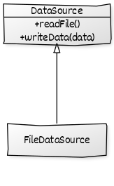

İlerleyen süreçte dosya işlemlerinde; yazılan dosyanın sıkıştırılması ya da bir çeşit imzalama işlemlerine tabi tutulması, okunan dosyaların değiştirilmiş olup olmadığı kontrol gibi senaryolar da gelebilir. Bu tür senaryolar karşısında mevcut sınıftan yeni sınıflar türetme yolunda ilerleriz.

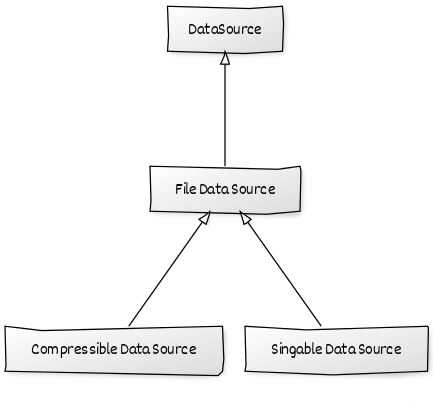

Gittikçe hiyerarşi artmaktadır. Bunun yanı sıra;

- Üst sınıflarda yapılacak herhangi bir değişiklik hiyerarşinin alt kısımlarını da etkilemektedir. 

- Sıkıştırma işlemlerini yaparken imzalama işleminin de yapılması istendiğinde ortaya bu farklı durumların kombinasyonu kadar sonuç çıkmaktadır.

- Çoğu programlama dilinde bir sınıfın sadece bir adet üst sınıfı olmaktadır, yani bir sınıftan türeyebiliyor. Bu da hiyerarşi için oldukça zor duruma sokacaktır bizleri.

- Kalıtım statik bir yapıdadır bu yüzden run-time sırasında nesnenin davranışı değiştirilemeyecektir. (Alt sınıf davranışları hariç)

gibi bir çok dezavantaj ortaya çıkmaktadır bu tür olaylarda. Bu tür durumlarda Composite tasarım deseni kullanılmaktadır. Kalıtımdan ziyade composition (bileşim) işlemi yapılmalıdır. Aşağıda bu desene ait UML diyagramı bulunmaktadır.

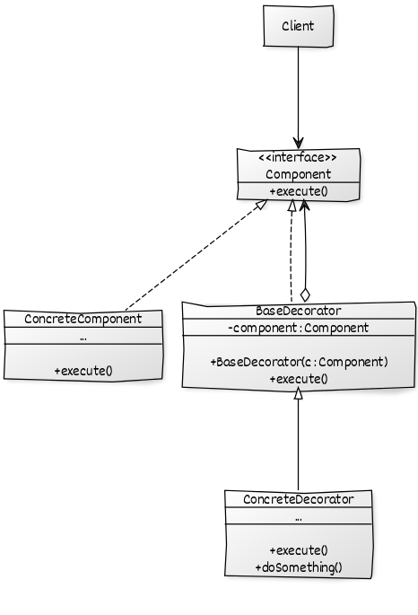

- **Component:** Üst sınıfların uygulaması için ortak bir arayüz. Bu arayüzde tanımlanan işlemler daha sonra `ConcreteDecorator` sınıfları tarafından değiştirilen tanımlamalardır.

- **ConcreteComponent:** Temel davranışın uygulandığı sınıftır. `ConcreteDecorator` sayesinde değiştirilecektir.

- **BaseDecorator:** `Component` arayüzünü uygular ve bu arayüzü uygulayan yapının referansını da barındırır.

- **ConcreteDecorator:** Yeni davranışların tanımlandığı sınıftır, `BaseDecorator` sınıfından türer.

C# Kod Örneği:

```csharp
// Üst sınıfların uygulayacağı arayüzdür.
// Yapılacak temel işlemler tanımlanmıştır.
// UML diyagramındaki Component arayüzüne denk gelmektedir.
interface IDataSource
{
    string GetFileName();
    void WriteData(object data);
    void ReadData();
}
```

```csharp
// Temel işlemlerin tanımlandığı IDataSource arayüzünü uygulayan sınıftır.
// UML diyagramındaki ConcreteComponent sınıfına denk gelmektedir.
class FileDataSource : IDataSource
{
    private string _fileName;

    public FileDataSource(string fileName)
    {
        _fileName = fileName;
    }

    public string GetFileName()
    {
        return _fileName;
    }

    public void ReadData()
    {
        Console.WriteLine($"{_fileName} readed.");
    }

    public void WriteData(object data)
    {
        Console.WriteLine($"data was written to {_fileName}.");
    }
}
```

```csharp
// UML diyagramındaki Component (IDataSource) arayüzünü uygular.
// Constructor sayesinde özellikleri değiştirilmesi istenen nesnenin referansı tutulur.
// Değiştirilmesini istediğimiz metotları abstract anahtar kelimesi ile işaretledik.
// UML diyagramındaki BaseDecorator yapısına denk gelmektedir.
abstract class BaseDataSourceDecorator : IDataSource
{
    protected IDataSource dataSource;

    public BaseDataSourceDecorator(IDataSource dataSource)
    {
        this.dataSource = dataSource;
    }

    public abstract string GetFileName();

    public abstract void ReadData();

    public abstract void WriteData(object data);
}
```

```csharp
// Yeni davranışların tanımlandığı sınıftır.
// UML diyagramındaki BaseDecorator (BaseDataSourceDecorator) sınıfından türer.
// UML diyagramındaki ConcreteDecorator sınıfına denk gelmektedir.
class ComporessionDecorator : BaseDataSourceDecorator
{
    public ComporessionDecorator(IDataSource dataSource) : base(dataSource)
    {
    }

    public override string GetFileName()
    {
        return base.dataSource.GetFileName();
    }

    public override void ReadData()
    {
        // Veriyi okurken referansını tuttuğumuz sınıfın kendi davranışını sergilemesini istiyoruz.
        base.dataSource.ReadData();
    }

    public override void WriteData(object data)
    {
        // Burada gelen veriye ait sıkıştırma işlemleri yapılacaktır.
        Console.WriteLine("Data compressed.");

        // Sıkıştırma işlemleri yapıldıktan sonra yazma işlemleri gerçekleştirilecektir.
        Console.WriteLine($"Compressed data was written to {base.dataSource.GetFileName()}.");
    }
}
```

```csharp
IDataSource dataSource = new FileDataSource("data.sql");

IDataSource compressedDataSource = new ComporessionDecorator(dataSource);

compressedDataSource.ReadData();
compressedDataSource.WriteData(new object());

// output:
//      data.sql readed.
//      Data compressed.
//      Compressed data was written to data.sql.
```

*Bu tasarım deseninin JAVA ve diğer diller için olan uygulamasını [bu tasarım deseni için oluşturulmuş klasörde](https://github.com/yusufyilmazfr/tasarim-desenleri-turkce-kaynak/tree/master/decorator) bulabilirsiniz.*

#### 📦 Facade

> Facade tasarım deseni, bir alt sistemdeki arayüzlere bir birleşik arayüz sağlayarak alt sistemin kullanımını daha kolay hale getirmeyi amaçlar.

Bu desendeki amaç karmaşık iş süreçlerini saklamaktır. Bunların yanı sıra algoritmalar, iş süreçleri vs. pek çok nesneden hizmet alarak ilerleyebilir. Bu detaylı bilgiler de bir nevi istemciden soyutlanmış olur.

Özetle: **amaç sistemi yeni bir alt yapıya sokmak değil, alt sınıflardaki karmaşıklığı soyutlayarak pratiklik sunmaktır.**

Senaryo olarak bir bankanın müşterilerine kredi kartı verdiklerini, bu kredi kartı verme işlemlerinden önce ise kendi iş kurallarını uyguladığını kabul edelim. Kodun kalabalık olmaması için temel olarak müşteriye kredi kartı vermeden önce kara listede olup olmadığı kontrol ediliyor olsun.

C# Kod Örneği:

```csharp
// Banka müşterimizi temsili oluşturan sınıf
class Customer
{
    public Customer(string firstName, string lastName)
    {
        FirstName = firstName;
        LastName = lastName;
    }

    public string FirstName { get; set; }
    public string LastName { get; set; }
}
```

```csharp
// Kara liste ile ilgili işlemlerin yapıldığı sınıf
class BlackListService
{
    public bool CheckEmployeeIsTheBlackList(Customer customer)
    {
        // Müşterinin kara listede olup olmadığının kontrolünün yapıldığı yer.
        // Kara listede ise false, değilse true dönmekte olduğunu var sayalım.
        // Burada veri tabanı kodları ya da harici bir servis ile iletişim sağlanabilir.
        // Default olarak true döndürdük.
        return true;
    }
}
```

```csharp
// Kredi kartı ile ilgili işlemlerin yapıldığı sınıf
class CreditCardManager
{
    public void CreateCreditCart(Customer customer)
    {
        // Parametre olarak gelen kullanıcıya ait kredi kartı oluşturma işleminin yapıldığı yer
    }
}
```

```csharp
// İstemci tarafından gerekli işlemlerin yapılması.
Customer duygu = new Customer("Duygu", "Kaya");

CreditCardManager creditCardManager = new CreditCardManager(); ;
BlackListService blackListService = new BlackListService();

if (blackListService.CheckEmployeeIsTheBlackList(duygu))
{
    creditCardManager.CreateCreditCart(duygu);
}
```

Yukarıdaki koda baktığımız zaman istemci tarafında önce müşterinin kara listede olup olmadığı kontrolü yapıldı daha sonra ise duruma göre kredi kartı oluşturması sağlandı. Buraya kadar pek de bir şey yok, çünkü bir adet kontrol var fakat tahmin edileceği üzere banka işlemlerinde birden fazla operasyonel işlem mevcut. Bu işlemlerin kalabalıklığından doğacak problemler arasında;

- Başka bir yerde kredi kartı oluşturulmak istendiğinde buradaki kodların aynısının oraya da yazılmasından kaynaklı kod kalabalığı olacaktır.
- İstemci tarafında bu işlemler gerçekleştiği için geliştiricinin bu doğrulama süreçlerini iyi ve eksiksiz takip etmesi gerekiyor olacak.
- Olası bir değişimde birden fazla yerde değişiklik yapması durumunda kalınacaktır.

Yukarıdaki temel nedenler olayın anlaşılması için yeterlidir.

Bu karmaşıklığın önüne geçmek için `Facade` tasarım deseni uygun bir çözümdür. Aşağıda bu desene ait UML diyagramı görülmektedir.

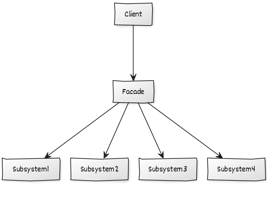

Yukarıdaki UML diyagramından esinlenerek kredi kartı işlemlerindeki karmaşıklığı `CreditCardFacade` adında oluşturduğumuz sınıf içerisinde gizleyebiliriz. Kodumuz aşağıdaki gibi olacaktır.

C# Kod Örneği:

```csharp
// Banka müşterimizi temsili oluşturan sınıf.
class Customer
{
    public Customer(string firstName, string lastName)
    {
        FirstName = firstName;
        LastName = lastName;
    }

    public string FirstName { get; set; }
    public string LastName { get; set; }
}
```

```csharp
// Kara liste ile ilgili işlemlerin yapıldığı sınıf
class BlackListService
{
    public bool CheckEmployeeIsTheBlackList(Customer customer)
    {
        // Müşterinin kara listede olup olmadığının kontrolünün yapıldığı yer.
        // Kara listede ise false, değilse true dönmekte olduğunu var sayalım.
        // Burada veri tabanı kodları ya da harici bir servis ile iletişim sağlanabilir.
        // Default olarak true döndürdük.
        return true;
    }
}
```

```csharp
//Kredi kartı ile ilgili işlemlerin yapıldığı sınıf
class CreditCardManager
{
    public void CreateCreditCart(Customer customer)
    {
        // Parametre olarak gelen kullanıcıya ait kredi kartı oluşturma işleminin yapıldığı yer
    }
}
```

```csharp
class CreditCardFacade
{
    public void CreateCreditCart(Customer customer)
    {
        CreditCardManager creditCardManager = new CreditCardManager(); ;
        BlackListService blackListService = new BlackListService();

        if (blackListService.CheckEmployeeIsTheBlackList(customer))
        {
            creditCardManager.CreateCreditCart(customer);
        }
    }
}
```

```csharp
Customer duygu = new Customer("Duygu", "Kaya");

CreditCardFacade creditCardFacade = new CreditCardFacade();
creditCardFacade.CreateCreditCart(duygu);
```

Bu sayede kod kalabalığının önüne geçilmiş olundu bunun da yanı sıra eklenecek yeni bir iş kuralında istemci tarafından herhangi bir değişikliğe gidilmemesi olumlu bir artı olarak geliyor.

*Bu tasarım deseninin JAVA ve diğer diller için olan uygulamasını [bu tasarım deseni için oluşturulmuş klasörde](https://github.com/yusufyilmazfr/tasarim-desenleri-turkce-kaynak/tree/master/facade) bulabilirsiniz.*

#### 🌫️ Flyweight

> Flyweight tasarım deseni, sık kullanılan nesnelerin bellek yönetimini kontrol etmek için kullanılan bir tasarım desenidir.

Bu kalıbın amacı aynı nesneleri bellekte çokça oluşturmak yerine her bir nesnenin bir kopyasını oluşturmak ve oluşturulan nesneleri ortak bir havuzda tutup istenildiği taktirde havuzdan nesnenin seçilip verilmesine dayanır.

Bu tasarım desenine ait UML diyagramı aşağıdaki gibidir.

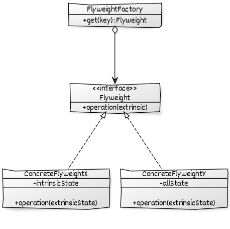

- **Flyweight:** Nesnenin ortak özelliklerini tutan yapıdır. Interface de olabilir abstract class da. 

- **ConcreteFlyweight:** Flyweight şablonunu uygulayan farklı nesneleri içeren sınıflardır.

- **FlyweightFactory:** `Flyweight` havuzunu tutacak sınıftır, eğer daha önceden nesne oluşturulmamışsa havuza atılacak oluşturulmuş ise de havuzdan seçilip verilecektir.

Yukarıdaki UML diyagramına bakıldığı zaman **intrinsic** gibi kavramlar göze çarpacaktır. Herbir Flyweight nesnesi temel olarak iki veri kümesinden oluşur. **Dahili (intrinsic)** olarak geçen **durum-bağımsız (state-independent)** kısım parçalardan birisir. Bu kısımda, çalışma zamanındaki tüm Flyweight nesneleri tarafından saklanan paylaşılmış alanlar yer almaktadır. Diğer parça ise **durum-bağımlı (state-dependent)** olarak bilinen ve **dışsal**  **(extrinsic)** olarak belirtilen kısımdır. Bu kümedeki veriler ise istemci tarafından saklanır, hesap edilir ve Flyweight nesne örneğine, yine Flyweight'in bir operasyonu yardımıyla aktarılırlar.

Senaryo olarak oyunda bir sahne tasarlandığını ve sahne arka planında bulunan kutuların rastgele yerleştirdiğini varsayalım. Burada kutuların değişen tek şeyi renk ve konumları olacaktır.

C# Kod Örneği:

```csharp
// Kutuların rengini tutmaktadır.
enum BoxColor
{
    Black,
    Blue
}
```

```csharp
// Nesnenin ortak özelliklerini tutan sınıftır.
// UML diyagramındaki Flyweight yapısına denk gelmektedir.
abstract class Box
{
    // Intrinsic değerler.
    public int width;
    public int height;
    public BoxColor boxColor;

    public abstract void Draw(int locationX, int locationY);
}
```

```csharp
// Flyweight (Box) şablonunu uygulayan sınıftır.
// UML diyagramındaki ConcreteFlyweight sınıfına denk gelmektedir.
class BlueBox : Box
{
    public BlueBox(int width, int height)
    {
        this.width = width;
        this.height = height;
        this.boxColor = BoxColor.Blue;
    }

    public override void Draw(int locationX, int locationY)
    {
        Console.WriteLine($"{boxColor} box drawn. {locationX},{locationY}");
    }
}
```

```csharp
// Flyweight (Box) şablonunu uygulayan sınıftır.
// UML diyagramındaki ConcreteFlyweight sınıfına denk gelmektedir.
class BlackBox : Box
{
    public BlackBox(int width, int height)
    {
        this.width = width;
        this.height = height;
        this.boxColor = BoxColor.Black;
    }

    public override void Draw(int locationX, int locationY)
    {
        Console.WriteLine($"{boxColor} box drawn. {locationX},{locationY}");
    }
}
```

```csharp
// Flyweight (Box) havuzunu tutacak sınıftır.
// Eğer daha önceden nesne oluşturulmamışsa havuza atılacak.
// Oluşturulmuş ise de havuzdan seçilip verilecektir.
// UML diyagramındaki FlyweightFactory sınıfına denk gelmektedir. 
class BoxFactory
{
    private Dictionary<BoxColor, Box> _boxes;

    public BoxFactory()
    {
        _boxes = new Dictionary<BoxColor, Box>();
    }


    public Box Get(BoxColor boxColor)
    {
        if (_boxes.ContainsKey(boxColor))
        {
            return _boxes[boxColor];
        }

        Box box = null;

        if (boxColor == BoxColor.Black)
        {
            box = new BlackBox(20, 20);
        }
        else if (boxColor == BoxColor.Blue)
        {
            box = new BlueBox(20, 20);
        }

        _boxes.Add(boxColor, box);
        return box;
    }
}
```

```csharp
BoxFactory boxFactory = new BoxFactory();

Box blackBox1 = boxFactory.Get(BoxColor.Black);
Box blackBox2 = boxFactory.Get(BoxColor.Black);
Box blackBox3 = boxFactory.Get(BoxColor.Black);
Box blueBox1 = boxFactory.Get(BoxColor.Blue);

blackBox1.Draw(97, 37);
blackBox2.Draw(34, 78);
blackBox3.Draw(74, 193);
blueBox1.Draw(1, 4);
// output:
//  Black box drawn. 97,37
//  Black box drawn. 34,78
//  Black box drawn. 74,193
//  Blue box drawn. 1,4
```

*Bu tasarım deseninin JAVA ve diğer diller için olan uygulamasını [bu tasarım deseni için oluşturulmuş klasörde](https://github.com/yusufyilmazfr/tasarim-desenleri-turkce-kaynak/tree/master/flyweight) bulabilirsiniz.*

#### 🔍 Proxy

> Proxy tasarım deseni, istemcinin orijinal nesneye direkt erişimi yerine bu erişimi nesneyi temsil eden proxy (vekil) sınıflar üzerinden gerçekleştirmesini ve bu proxy (vekil) sınıfların sunduğu imkanları kullanmasını sağlayan tasarım desenidir.

Uygulama boyunca belirli bir işlemlerimizi yerine getiren sınıflarımız mevcuttur. Sınıf örneklerimizi kullanırken kimi işlemleri kontrol etmek gerekiyor. Bu kontroller, erişimin kısıtlı olması gibi işlemler olabilir. Bunların yanı sıra oluşturulması maliyetli olan nesnelerin birden fazla oluşturulmamasının kontrolü ya da o nesneye erişmeden önce güvenlik gereği işlemlerin kayıt altına alınması gibi işlemler de gerçekleştirilebilir. Proxy tasarım deseni, buradan bizlere gerçek nesneye erişmeden önce gerekli işlemleri yapmamızı sağlar. Aşağıda bu tasarım desenine ait UML diyagramı görülmektedir.

 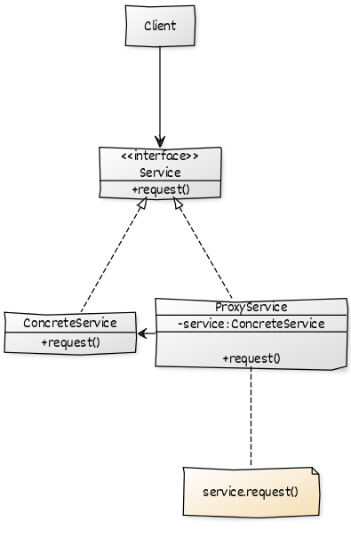

- **Service:** Operasyonel işlemlerin tanımlandığı arayüzdür. İstemci bu arayüz ile ilgilenmektedir.

- **ConcreteService:** Gerçek işleri yapan, istemcinin direkt erişmesini istemediğimiz sınıftır.

- **ProxtService:** İstemcinin muhatabı olacağı sınıftır, `ConcreteService`  sınıfına direkt erişimi engeller ve bu sınıf örneğinin referansını tutar.

Senaryo olarak COVID-19 virüsünden dolayı maske siparişi verildiğini ve maske siparişi verilmeden önce vatandaşa ait T.C kimlik numarası ve adres doğrulamasının yapıldığı düşünülsün.

C# Kod Örneği:

```csharp
// Sipariş işlemlerini gerçekleştiren sınıflar tarafından uygulanan arayüz.
// UML diyagramındaki Service arayüzüne denk gelmektedir.
interface IOrderableMask
{
    void CreateOrder(Person person);
}
```

```csharp
// Maske siparişininin oluşturulduğu sınıf.
// İstemcinin direkt erişmesini istemediğimiz alandır.
// UML diyagramındaki ConcreteService sınıfına denk gelmektedir.
class MaskOrder : IOrderableMask
{
    public void CreateOrder(Person person)
    {
        // Burada siparişin oluşturulma işlemleri yer alacaktır.

        Console.WriteLine($"Order created to {person.Address}.");
    }
}
```

```csharp
// İstemcinin muhatap olacağı sınıftır.
// Proxy sınıfımızdır.
// Gerçek işi yapan MaskOrder sınıfının referansını tutar.
// Sipariş verilmeden önce vatandaşın bilgilerinin kontrolü yapılır.
class AuthenticatableMaskOrderProxy : IOrderableMask
{
    private IOrderableMask _orderMask;

    public AuthenticatableMaskOrderProxy()
    {
        _orderMask = new MaskOrder();
    }

    public void CreateOrder(Person person)
    {
        // Sipariş oluşturulmadan önce kimlik kontrolü yapılıyor.
        bool isValid = CheckPersonIsValid(person);

        if (isValid)
        {
            _orderMask.CreateOrder(person);
        }
    }

    private bool CheckPersonIsValid(Person person)
    {
        // Burada Mernis servisleri ile iletişim sağlanabilir.
        // Örnek amaçlı TC numarasının 11 karakter olması yeterlidir. 
        // Örnek amaçlı adres alanının boş olmaması yeterlidir. 
        return person.TC.Length == 11 && person.Address != "";
    }
}
```

```csharp
// Maske siparişini verecek kullanıcıları temsili sınıf.
class Person
{
    public string TC { get; set; }
    public string Address { get; set; }

    public Person(string tc, string address)
    {
        TC = tc;
        Address = address;
    }
}
```

```csharp
Person semanur = new Person("11111111111", "İstanbul/Sancaktepe xxx-yyy-zzz");

IOrderableMask orderableMask = new AuthenticatableMaskOrderProxy();
orderableMask.CreateOrder(semanur);

// output: Order created to İstanbul/Sancaktepe xxx-yyy-zzz.
```

*Bu tasarım deseninin JAVA ve diğer diller için olan uygulamasını [bu tasarım deseni için oluşturulmuş klasörde](https://github.com/yusufyilmazfr/tasarim-desenleri-turkce-kaynak/tree/master/proxy) bulabilirsiniz.*

### Behavioral (Davranışsal)

> Davranışsal tasarım desenleri, nesneler arası ortak haberleşmeyi efektif ve esnek bir yapıya getirmemizi  sağlar.

- [Chain of Responsibility](#%EF%B8%8F-chain-of-responsibility)
- [Command](#-command)
- [Interpreter](#%EF%B8%8F-interpreter)
- [Iterator](#%EF%B8%8F-iterator)
- [Mediator](#-mediator)
- [Memento](#%EF%B8%8F-memento)
- [Observer](#-observer)
- [State](#-state)
- [Strategy](#-strategy)
- [Template Method](#-template-method)
- [Visitor](#%EF%B8%8F-visitor)

#### ⛓️ Chain of Responsibility

> Chain of Responsibility tasarım deseni, bir amaca yönelik bir dizi işlemi gerçekleştiren nesnelerin birbirinden bağımsız bir şekilde çalışmasını ve herbir nesnenin sadece kendisiyle tanımlı işleri yapmasını sağlayan bir tasarım desenidir.

Geliştirdiğimiz uygulamada gelen görselleri PNG formatına çevirdiğimiz var sayılsın.

C# Kod Örneği:

```csharp
// Uygulama süresince resimlerimizi temsil edecek sınıf.
class Image
{
    public string name;
    public string extension;

    public Image(string name, string extension)
    {
        this.name = name;
        this.extension = extension;
    }
}
```

```csharp
Image image = new Image("tatil-fotografim", "JPEG");

if (image.extension == "JPG")
{
    // JPG işlemine ait dönüştürme kodları işlemleri.
}
else if (image.extension == "JPEG")
{
    // JPEG işlemine ait dönüştürme kodları işlemleri.
}
else
{
    // Diğer türlere ait dönüştürme işlemleri.
}
```

Yukarıdaki koda bakıldığı zaman if-else içerisinde bir yığın görünmektedir. Herbir if bloğu kendi başına bir işlem. Yeni bir uzantı geldiğinde tekrardan bir blok açmamız gerekecektir, bunların yanı sıra bu kodu başka bir yerde de kullanılmak istendiğinde iyice kod kalabalığına da sebep olacaktır. Bu tasarım deseni, bizlere sorumlulukları ayrı bir sınıfa ayırmamızı ve birbirlerine gevşek bağlı olacak şekilde bağlamamızı söylüyor. Aşağıda bu desene ait UML diyagramı mevcuttur. Kodu UML diyagramına bakarak aşağıdaki gibi düzenleyebiliriz.

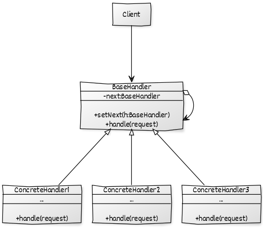

C# Kod Örneği:

```csharp
// Uygulama süresince resimlerimizi temsil edecek sınıf.
class Image
{
    public string name;
    public string extension;

    public Image(string name, string extension)
    {
        this.name = name;
        this.extension = extension;
    }
}
```

```csharp
// Zincirin bir sonraki halkasının referansının tutulduğu sınıftır.
// İşlemi gerçekleştirecek olan metot tanımı bulunur.
// UML diyagramındaki BaseHandler sınıfına denk gelmektedir.
abstract class BaseHandler
{
    protected BaseHandler _nextHandler;
    public void SetNextHandler(BaseHandler nextHandler)
    {
        _nextHandler = nextHandler;
    }

    public abstract void HandleRequest(Image image);
}
```

```csharp
// JPEG dosyalarını dönüştüren sınıf.
// UML diyagramındaki ConcreteHandler sınıfına denk gelmektedir.
class JPEGHandler : BaseHandler
{
    public override void HandleRequest(Image image)
    {
        if (image.extension == "JPEG")
        {
            Console.WriteLine("JPEG to PNG");
            // JPEG işlemine ait dönüştürme kodları işlemleri.
        }
        else
        {
            // Bu sınıfa ait bir işlem değilse zincirin bir sonraki halkasına aktarılır.
            _nextHandler.HandleRequest(image);
        }
    }
}
```

```csharp
// JPG dosyalarını dönüştüren sınıf.
// UML diyagramındaki ConcreteHandler sınıfına denk gelmektedir.
class JPGHandler : BaseHandler
{
    public override void HandleRequest(Image image)
    {
        if (image.extension == "JPG")
        {
            Console.WriteLine("JPG to PNG");
            // JPG işlemine ait dönüştürme kodları işlemleri.
        }
        else
        {
            // Bu sınıfa ait bir işlem değilse zincirin bir sonraki halkasına aktarılır.
            _nextHandler.HandleRequest(image);
        }
    }
}
```

```csharp
// Herhangi bir tipteki dosyayı dönüştüren sınıf.
// UML diyagramındaki ConcreteHandler sınıfına denk gelmektedir.
class CustomHandler : BaseHandler
{
    public override void HandleRequest(Image image)
    {
        if (image.extension == "OtherExtension")
        {
            Console.WriteLine("OtherExtension to PNG");
            // Herhangi bir tipteki dosyanın işlemine ait dönüştürme kodları işlemleri.
        }
        // Burada else ifadesi bulunmamaktadır bu da zincirin son halkası olduğu anlamına gelir.
    }
}
```

```csharp
Image image = new Image("tatil-fotografim", "JPG");

JPEGHandler jpegHandler = new JPEGHandler();
JPGHandler jpgHandler = new JPGHandler();
CustomHandler customHandler = new CustomHandler();

// Zincirlerin birbirleri ile bağlantısının yapıldığı yerdir.
// JPEG bu işlemi gerçekleştiremezse JPG'e aktarır o da Custom'a aktarır.
jpegHandler.SetNextHandler(jpgHandler);
jpgHandler.SetNextHandler(customHandler);

jpegHandler.HandleRequest(image); // output: JPG to PNG
```

Bu tasarım desenini bu probleme uyarlayarak;

- Tekrar kullanılabilir kod elde ettik.
- Bağımlılıkları gevşek hale getirdik.
- Zincirin halkası istemci tarafından değiştirilebilir bu sayede de genişletilebilir bir yapı elde edildi.

gibi faydaları görebilmekteyiz.

*Bu tasarım deseninin JAVA ve diğer diller için olan uygulamasını [bu tasarım deseni için oluşturulmuş klasörde](https://github.com/yusufyilmazfr/tasarim-desenleri-turkce-kaynak/tree/master/chain-of-responsibility) bulabilirsiniz.*

#### ⚔ Command

> Command tasarım deseni, kullanıcı isteklerini gerçekleştiren kod yapısını sarmallayarak nesneler halinde saklanmasını daha sonra da bu isteklerin gerçekleştirilmesini veya geri alınmasını sağlayan tasarım desenidir.

Nesne üzerinde bir işleminin nasıl yapıldığını bilmediğimiz ya da kullanılmak istenen nesneyi tanımadığımız durumlarda kullanılır.

Bu tasarım desenine ait UML diyagramı aşağıdaki gibidir.

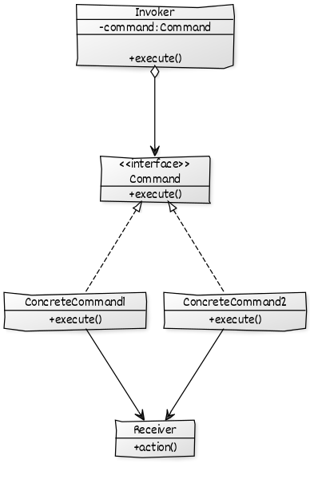

- **Command:** Temel arayüzdür, komutların çalıştırılması için temel metotu içermektedir.

- **ConcreteCommand:** Nesnelere dönüştürdüğümüz her bir isteğe denk gelmektedir, `Command` arayüzünü uygular.

- **Invoker:**  `Command` referansını tutan, metotun ne zaman çağrılacağını belirtir.

- **Receiver:** `Client` tarafının asıl iletişime geçeceği sınıftır.

Senaryo olarak bir ürüne ait stok takibi verilen basit bir sistem olduğunu var sayalım. Burada stok ile ilgili işlemler bu tasarım desenine göre yapılsın. 

C# Kod Örneği:

```csharp
// Komutları nesneler haline getirelecek olan sınıf.
// UML diyagramındaki Receiver sınıfına denk gelmektedir.
class StockManager
{
    private string _name;
    private int _quantity;

    public StockManager(string name, int quantity)
    {
        _name = name;
        _quantity = quantity;
    }

    public void Buy()
    {
        Console.WriteLine($"Stock: {_name}, {_quantity} bought!");
    }

    public void Sell()
    {
        Console.WriteLine($"Stock: {_name}, {_quantity} sold!");
    }
}
```

```csharp
// Temel arayüzdür.
// Komutların çalıştırılması için temel metotu içermektedir.
// UML diyagramındaki Command arayüzüne denk gelmektedir.
interface IOrderCommand
{
    void Execute();
}
```

```csharp
// Nesnelere dönüştürdüğümüz her bir isteğe denk gelmektedir.
// Command (IOrderCommand) arayüzünü uygular.
// UML diyagramındaki ConcreteCommand sınıfına denk gelmektedir.
class BuyStock : IOrderCommand
{
    private StockManager _stockManager;

    public BuyStock(StockManager stockManager)
    {
        _stockManager = stockManager;
    }

    public void Execute()
    {
        _stockManager.Buy();
    }
}
```

```csharp
// Nesnelere dönüştürdüğümüz her bir isteğe denk gelmektedir.
// Command (IOrderCommand) arayüzünü uygular.
// UML diyagramındaki ConcreteCommand sınıfına denk gelmektedir.
class SellStock : IOrderCommand
{
    private StockManager _stockManager;

    public SellStock(StockManager stockManager)
    {
        _stockManager = stockManager;
    }

    public void Execute()
    {
        _stockManager.Sell();
    }
}
```

```csharp
// Command (IOrderCommand) arayüzünü uygulayan sınıf referansını tutar.
// Metotun ne zaman çağrılacağını belirtir.
// UML diyagramındaki Invoker sınıfına denk gelmektedir.
class StockController
{
    private List<IOrderCommand> _orderCommands;

    public StockController()
    {
        _orderCommands = new List<IOrderCommand>();
    }

    public void TakeOrder(IOrderCommand command)
    {
        _orderCommands.Add(command);
    }

    public void PlaceOrders()
    {
        foreach (IOrderCommand command in _orderCommands)
        {
            command.Execute();
        }

        _orderCommands.Clear();
    }
}
```

```csharp
StockManager stockManager = new StockManager("iPhone", 200);

BuyStock buyStock = new BuyStock(stockManager);
SellStock sellStock = new SellStock(stockManager);

StockController stockController = new StockController();

stockController.TakeOrder(buyStock);
stockController.TakeOrder(sellStock);
stockController.TakeOrder(sellStock);


stockController.PlaceOrders();
// output:
//  Stock: iPhone, 200 bought!
//  Stock: iPhone, 200 sold!
//  Stock: iPhone, 200 sold!
```

*Bu tasarım deseninin JAVA ve diğer diller için olan uygulamasını [bu tasarım deseni için oluşturulmuş klasörde](https://github.com/yusufyilmazfr/tasarim-desenleri-turkce-kaynak/tree/master/command) bulabilirsiniz.*

#### 🈂️ Interpreter

> Interpreter tasarım deseni, belli bir düzen veya kurala göre sıralanmış verilerin, yorumlanarak istenilen çıktı üretmesini sağlar.

Bu tasarım desenine ait UML diyagramı aşağıdaki gibidir.

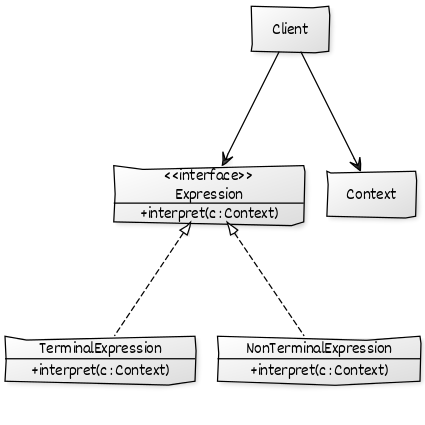

- **Expression:** Yorumlama işleminin tanımlandığı arayüz.

- **TerminalExpression:** Dil bilgisindeki terminal ifadeler üzerinde işlem yapar.

- **Context:** Yorumlanacak olan içerik.

Senaryo olarak bir projeye başlayacağımızı ve proje ekibinin verilerinin bir dizgi olarak geldiğini;

- Geliştirici: G karakteri ve 4000 malitet.

- Muhasebeci: M karakteri ve 3000 maliyet.

- Takım Lideri: L karakteri ve 7000 maliyet.

varsayalım. Örnek senaryo olarak **GGML** olarak gelen bir dizginin; 2 geliştirici, 1 muhasebeci, 1 takım lideri olarak toplamda 18000 maliyet oluşturduğu anlaşılmaktadır. Bu işlemleri yapan kodu Interpreter tasarım deseni kullanarak gerçekleştirelim.

C# Kod Örneği:

```csharp
// Yorumlanacak olan içeriktir.
// UML diyagramındaki Context sınıfına denk gelir.
class Context
{
    public string formula;
    public int totalPoint;

}
```

```csharp
// Yorumlama işleminin tanımlandığı arayüz.
// UML diyagramındaki Expression arayüzüne denk gelmektedir.
interface JobExpression
{
    void Interpret(Context context);
}
```

```csharp
// Dil bilgisindeki terminal ifadeler üzerinde işlem yapar.
// UML diyagramındaki TerminalExpression sınıfına denk gelmektedir.
class TeamLeadExpression : JobExpression
{
    public void Interpret(Context context)
    {
        if (context.formula.Contains('L'))
        {
            context.totalPoint += 7000;
        }
    }
}
```

```csharp
// Dil bilgisindeki terminal ifadeler üzerinde işlem yapar.
// UML diyagramındaki TerminalExpression sınıfına denk gelmektedir.
class AccountingExpression : JobExpression
{
    public void Interpret(Context context)
    {
        if (context.formula.Contains('M'))
        {
            context.totalPoint += 3000;
        }
    }
}
```

```csharp
// Dil bilgisindeki terminal ifadeler üzerinde işlem yapar.
// UML diyagramındaki TerminalExpression sınıfına denk gelmektedir.
class DeveloperExpression : JobExpression
{
    public void Interpret(Context context)
    {
        if (context.formula.Contains('G'))
        {
            context.totalPoint += 4000;
        }
    }
}
```

```csharp
class JobManager
{
    public List<IJobExpression> CreateExpressionTree(string formula)
    {
        List<IJobExpression> tree = new List<IJobExpression>();

        foreach (char role in formula)
        {
            switch (role)
            {
                case 'G':
                    tree.Add(new DeveloperExpression());
                    break;
                case 'M':
                    tree.Add(new AccountingExpression());
                    break;
                case 'L':
                    tree.Add(new TeamLeadExpression());
                    break;
                default:
                    throw new Exception("Unexpected role!");
            }
        }
        return tree;
    }

    public void RunExpression(Context context)
    {
        foreach (IJobExpression expression in CreateExpressionTree(context.formula))
        {
            expression.Interpret(context);
        }
    }
}
```

```csharp
Context context = new Context();
context.formula = "GGML";

JobManager jobManager = new JobManager();
jobManager.RunExpression(context);

Console.WriteLine($"{context.formula} :> {context.totalPoint}");
// output: GGML :> 18000
```

*Bu tasarım deseninin JAVA ve diğer diller için olan uygulamasını [bu tasarım deseni için oluşturulmuş klasörde](https://github.com/yusufyilmazfr/tasarim-desenleri-turkce-kaynak/tree/master/interpreter) bulabilirsiniz.*

#### 🚶‍♂️ Iterator

> Iterator tasarım deseni, koleksiyon üzerindeki elemanların üzerinde dolaşmak için kullanılan tasarım desenidir.

Uygulamalarımızı geliştirirken verilerimizi bir yerlerde tutma gereği duyarız. Burada birçok seçenek vardır. Ağaç, liste, kuyruk, yığın gibi. Liste gibi yapılarda dolaşmak, verileri elde etmek kolaydır fakat iş kompleks yapılara doğru gittiğinde veri üzerinde dolanmak biraz daha zorlaşabiliyor. 


Örneğin; Ağaç yapısını kullandığınızı ve veri üzerinde dolanma işlemleri için **inorder** seçeneğini seçtiniz. Fakat başka bir zaman mecburi bir değişiklikten sonra arama yönteminizi **postorder** olarak değiştirdiniz. Burada sürekli bir değişim mevcuttur. Bunları soyutlamak, değişikliğe adapte olmak gibi bir çok işlemleri Iterator tasarım deseni ile gerçekleştirilebilmektedir.

Iterator tasarım deseninin en önemli özelliği gezdiği koleksiyonun ne olduğunu bilmemesidir yani iterasyon işlemlerini gerçekleştirmek üzere kurguludur. Böylece kullandığı veri yapısının ve çalışma tarzının uygulamanın diğer kısımları ile olan bağlantılarını en aza indirilir. Bu iterasyon işlemlerinin gerçekleştiği yapı; liste, ağaç, kuyruk vs. olabilir. 

Bu tasarım desenine ait UML diyagramı aşağıdaki gibidir.

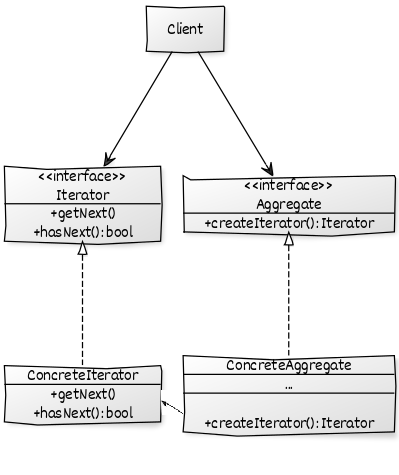

- **Iterator:** Koleksiyon üzerinde dolaşmak, nesneleri elde edebilmek için gerekli operasyonların tanımlandığı arayüzdür. Bir sonraki elemana geçme, bir sonraki elemanın olup olmadığı gibi.

- **ConcreteIterator:** `Iterator` arayüzünü ve koleksiyon üzerinde dolaşmak için gerekli metotları uygular. Veriler üzerinde dolanma işlemleri burada gerçekleştirilecektir.

- **Aggregate:** `Iterator` arayüzünü uygulayan sınıf örneklerini elde etmek için metot içerir. Bu sayede birden fazla `Iterator` arayüzünü uygulayan sınıfların örneklerini elde edebiliriz.

- **ConcreteAggregate:** `Aggregate` arayüzünü uygular ve `Iterator` arayüzünü uygulayan sınıf örneği üretir.

Senaryo olarak elimizde bir çalışan listesi olduğu ve bu liste üzerinde işlemler yapıldığı varsayılsın.

C# Kod Örneği:

```csharp
// Liste üzerinde gezilecek olan elamnı temsil eden sınıf.
class Employee
{
    public int id;
    public string firstName;
    public string lastName;

    public Employee(int id, string firstName, string lastName)
    {
        this.id = id;
        this.firstName = firstName;
        this.lastName = lastName;
    }
}
```

```csharp
// Koleksiyon üzerinde dolaşmak için operasyonların tanımlandığı arayüzdür.
// Bir sonraki elemana geçme, bir sonraki elemanın olup olmadığı gibi.
// UML diyagramındaki Iterator arayüzüne denk gelmektedir.
// Generic bir yapı sağlanarak birçok yerde kullanılması sağlanır.
interface IIterator<T>
{
    bool HasNext();
    T GetCurrentItem();
}
```

```csharp
// Iterator arayüzünü uygulayan sınıf örneklerini elde etmek için metot içerir.
// Bu sayede çeşitli Iterator arayüzünü uygulayan sınıfların örneklerini elde edebiliriz.
// UML diyagramındaki Aggregate arayüzüne denk gelmektedir.
interface IEmployeeAggregate
{
    IIterator<Employee> CreateIterator();
}
```

```csharp
// Aggregate (IEmployeeAggregate) arayüzünü uygular ve Iterator arayüzünü uygulayan sınıf örneği üretir.
// Değerlerin referansları burada bulunur.
// UML diyagramındaki ConcreteAggregate  sınıfına denk gelmektedir.
class EmployeeListAggregate : IEmployeeAggregate
{
    private List<Employee> _employees;

    public EmployeeListAggregate()
    {
        _employees = new List<Employee>();
    }

    public void Add(Employee employee)
    {
        _employees.Add(employee);
    }

    public int Count()
    {
        return _employees.Count;
    }

    public Employee Get(int index)
    {
        return _employees[index];
    }

    public IIterator<Employee> CreateIterator()
    {
        return new EmployeeIterator(this);
    }
}
```

```csharp
// Iterator arayüzünü ve koleksiyon üzerinde dolaşmak için gerekli metotları uygular.
// Veriler üzerinde dolanma işlemleri burada gerçekleştirilecektir.
// ConcreteAggregate (EmployeeListAggregate) sınıfı ile birlikte çalışır
class EmployeeIterator : IIterator<Employee>
{
    private EmployeeListAggregate _employeeListAggregate;
    private int _currentIndex;

    public EmployeeIterator(EmployeeListAggregate employeeListAggregate)
    {
        _employeeListAggregate = employeeListAggregate;
        _currentIndex = 0;
    }

    public Employee GetCurrentItem()
    {
        return _employeeListAggregate.Get(_currentIndex++);
    }

    public bool HasNext()
    {
        if (_employeeListAggregate.Count() > _currentIndex)
        {
            return true;
        }
        return false;
    }
}
```

```csharp
EmployeeListAggregate employeeListAggregate = new EmployeeListAggregate();

Employee yusuf = new Employee(1, "Yusuf", "Yılmaz");
Employee arafat = new Employee(2, "Arafat", "Önlük");
Employee derya = new Employee(3, "Derya", "Obi");

employeeListAggregate.Add(yusuf);
employeeListAggregate.Add(arafat);
employeeListAggregate.Add(derya);

var iterator = employeeListAggregate.CreateIterator();

while (iterator.HasNext())
{
    Employee currentEmployee = iterator.GetCurrentItem();
    Console.WriteLine($"{currentEmployee.firstName} {currentEmployee.lastName}");
}

// output:
//  Yusuf Yılmaz
//  Arafat Önlük
//  Derya Obi
```

*Bu tasarım deseninin JAVA ve diğer diller için olan uygulamasını [bu tasarım deseni için oluşturulmuş klasörde](https://github.com/yusufyilmazfr/tasarim-desenleri-turkce-kaynak/tree/master/iterator) bulabilirsiniz.*

#### 🗼 Mediator

> Mediator tasarım deseni, aynı tipteki veya aynı arayüzü uygulayan nesneler arasında iletişimi sağlayan tasarım desenidir.

Nesneler arasında direkt iletişim kurmaktansa, ortaya bir ara sınıf (Mediator) koyarak tüm haberleşme işlerini bu ortak nesne üzerinden gerçekleştirerek direkt olarak birbirileri ile haberleşmelerini engellemektir bu desendeki amacımız. Bunların yanı sıra sınıfların sayısı arttıkça, aralarındaki bağımlılıklar da artar, uygulamanın bakımı ve değiştirilmesi zorlaşır. Mediator tasarım deseni,  bu sınıflar arasındaki bağımlılıkları azaltmaya ve aralarındaki iletişimi kolaylaştırmaya da yarar.

Bu tasarım desenine ait UML diyagramı aşağıdaki gibidir.

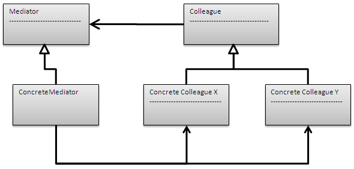

- **Mediator:** `Colleague` nesneler arasındaki iletişim arayüzünü tanımlar.

- **ConcreteMediator:** `Mediator` arayüzünü uygular  ve `Colleague` nesneleri arasındaki iletişimi koordine eder.

- **Colleague:** Haberleşme için ortak bir arayüz sağlar.

- **ConcreteColleague:** `Colleague` arayüzünü uygular ve diğer `Mediator` sayesinde diğer `Colleague`  sınıf örnekleri ile iletişim kurmaya çalışır.

Senaryo olarak online bir sohbet odası olduğu ve bu odada kullanıcıların 1-1 görüşme yaptıkları kabul edilsin. Desen gereği kullanıcılar direkt birbirleri ile iletişim kuramayacakları için işlemler `Mediator `üzerinden gerçekleştirilecektir.

C# Kod Örneği:

```csharp
// Haberleşme için ortak bir arayüz sağlar.
// Haberleşme Mediator tarafından gerçekleşeceği için bir örneğini tutar.
// Mesaj alma ve mesaj gönderme özellikleri içermektedir.
// UML diyagramındaki Colleague yapısına denk gelir.
abstract class User
{
    public int id;
    public string name;

    private IChatRoomMediator _chatRoomMediator;

    public User(IChatRoomMediator chatRoomMediator)
    {
        _chatRoomMediator = chatRoomMediator;
    }

    public void ReceiveMessage(string message)
    {
        Console.WriteLine($"{name} received new message. Message: {message}");
    }

    public void SendMessage(string message, int userId)
    {
        Console.WriteLine($"{name} send new message to: {userId} id user.");
        _chatRoomMediator.SendMessage(message, userId);
    }
}
```

```csharp
// Colleague (User) soyutundan türer.
// Mediator sayesinde diğer sınıf örnekler ile iletişim kurar.
// UML diyagramındaki ConcreteColleague yapısına denk gelmektedir.
class ChatUser : User
{
    public ChatUser(IChatRoomMediator chatRoomMediator) : base(chatRoomMediator)
    {

    }
}
```

```csharp
// Colleague (User) nesneler arasındaki iletişim arayüzünü tanımlar.
// UML diyagramındaki Mediator arayüzüne denk gelmektedir.
interface IChatRoomMediator
{
    void SendMessage(string message, int userId);
    void AddUserInRoom(User user);
}
```

```csharp
// Mediator (IChatRoomMediator) arayüzünü uygular.
// Colleague (User) nesneleri arasındaki iletişimi koordine eder.
// UML diyagramındaki ConcreteMediator yapısına denk gelmektedir.
class ChatRoomMediator : IChatRoomMediator
{
    private Dictionary<int, User> _userDictionary;

    public ChatRoomMediator()
    {
        _userDictionary = new Dictionary<int, User>();
    }

    public void AddUserInRoom(User user)
    {
        _userDictionary.Add(user.id, user);
    }

    public void SendMessage(string message, int userId)
    {
        User user = _userDictionary[userId];
        user.ReceiveMessage(message);
    }
}
```

```csharp
IChatRoomMediator chatRoom = new ChatRoomMediator();

// Sohbet odasına dahil olacak kullanıcıların oluşturulması.
// Ortak Mediator arayüzü ile haberleşmesi.
User yusuf = new ChatUser(chatRoom);
yusuf.id = 1;
yusuf.name = "Yusuf";

User sema = new ChatUser(chatRoom);
sema.id = 2;
sema.name = "Semanur";

User derya = new ChatUser(chatRoom);
derya.id = 3;
derya.name = "Derya";

User aleyna = new ChatUser(chatRoom);
aleyna.id = 4;
aleyna.name = "Aleyna";

// Mediator içerisindeki kullanıcı listesine atama işlemleri.
chatRoom.AddUserInRoom(yusuf);
chatRoom.AddUserInRoom(sema);
chatRoom.AddUserInRoom(derya);
chatRoom.AddUserInRoom(aleyna);

yusuf.SendMessage("Naber kız?", sema.id);
sema.SendMessage("Sanane be?", yusuf.id);

// output:
//  Yusuf send new message to: 2 id user.
//  Semanur received new message.Message: Naber kız?
//  Semanur send new message to: 1 id user.
//  Yusuf received new message.Message: Sanane be?
```

*Bu tasarım deseninin JAVA ve diğer diller için olan uygulamasını [bu tasarım deseni için oluşturulmuş klasörde](https://github.com/yusufyilmazfr/tasarim-desenleri-turkce-kaynak/tree/master/mediator) bulabilirsiniz.*

#### ↪️ Memento

> Memento tasarım deseni, bir nesnenin önceki durumunu kaydetmemizi ve istenildiği takdirde eski haline dönmemizi sağlayan tasarım desenidir.

Bu desene ait UML diyagramı aşağıdaki gibidir.

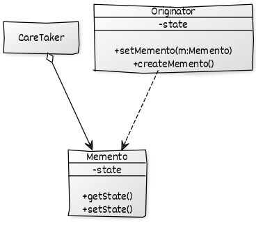

- **Memento:** Saklamak istediğimiz nesnemizin tamamını ya da bir kısmını tutan sınıftır.

- **CareTaker:** Memento'ların (saklanan nesnelerin) referansının tutulduğu sınıftır.

- **Originator:** Değerleri tutulacak olan ve önceki değerlerine geri dönebilen sınıftır.

Senaryo olarak bir metin editörü geliştirdiğimizi ve bu metin editöründe önceki yazdıklarımıza ve o anki cursor pozisyonuna geri dönebildiğimizi düşünelim.

C# Kod Örneği:

```csharp
// Saklamak istediğimiz değerlerin tanımlandığı yerdir.
// UML diyagramındaki Memento yapısına denk gelir.
class TextMemento
{
    public string Text { get; set; }
    public int CursorPosition { get; set; }
}
```

```csharp
// Memento'ların referansının tutulduğu yerdir.
// UML diyagramındaki CareTaker yapısına denk gelmektedir.
class TextUndoCareTaker
{
    private Stack<TextMemento> _mementos;

    public TextUndoCareTaker()
    {
        _mementos = new Stack<TextMemento>();
    }

    // Çağrılma işlemi yapıldığında yığının en üstündeki Memento örneği silinir ve geriye döndürülür.

    // Ekleme işlemi yapıldığında yığının en üstüne Memento örneği eklenir.
    // Klasik Stack.
    public TextMemento TextMemento
    {
        get
        {
            return _mementos.Pop();
        }
        set
        {
            _mementos.Push(value);
        }
    }
}
```

```csharp
// Değerleri tutulacak olan ve önceki değerlerine geri dönebilen sınıftır.
// UML diyagramındaki Originator yapısına denk gelmektedir.
// Geriye dönebilme özelliği olduğundan önceki durumları tutan CareTaker referansını tutmaktadır.
class TextOriginator
{
    public string Text { get; set; }
    public int CursorPosition { get; set; }

    private TextUndoCareTaker _textCareTaker;

    public TextOriginator()
    {
        _textCareTaker = new TextUndoCareTaker();
    }

    // Anlık kayıt değerlerini UML diyagramındaki CareTaker üzerinden yığına eklemektedir.
    public void Save()
    {
        _textCareTaker.TextMemento = new TextMemento
        {
            CursorPosition = this.CursorPosition,
            Text = this.Text
        };
    }

    // Geri alma işleminde yığının en üstündeki değeri alır.
    // Değer alma işleminden sonra sınıfın mevcut değerlerine atanır.
    public void Undo()
    {
        TextMemento previousTextMemento = _textCareTaker.TextMemento;

        CursorPosition = previousTextMemento.CursorPosition;
        Text = previousTextMemento.Text;
    }

    public override string ToString()
    {
        return $"text: {Text}, cursor position: {CursorPosition}";
    }
}
```

```csharp
TextOriginator textOriginator = new TextOriginator();

textOriginator.Text = "asm";
textOriginator.CursorPosition = 3;

// Anlık durum yığına ekleniyor.

textOriginator.Save();


textOriginator.Text = "asmi";
textOriginator.CursorPosition = 4;

// Anlık durum yığına ekleniyor.
textOriginator.Save();

textOriginator.Text = "asmin";
textOriginator.CursorPosition = 5;

// Anlık durum yığına ekleniyor.
textOriginator.Save();

// Yığındaki bir önceki duruma geçiyor.
textOriginator.Undo();
Console.WriteLine(textOriginator.ToString());

// Yığındaki bir önceki duruma geçiyor.
textOriginator.Undo();
Console.WriteLine(textOriginator.ToString());

// Yığındaki bir önceki duruma geçiyor.
textOriginator.Undo();
Console.WriteLine(textOriginator.ToString());

//output:
//  text: asmin, cursor position: 5
//  text: asmi, cursor position: 4
//  text: asm, cursor position: 3
```

*Bu tasarım deseninin JAVA ve diğer diller için olan uygulamasını [bu tasarım deseni için oluşturulmuş klasörde](https://github.com/yusufyilmazfr/tasarim-desenleri-turkce-kaynak/tree/master/memento) bulabilirsiniz.*

#### 👓 Observer

> Observer tasarım deseni, bir nesnede meydana gelen değişikliği içinde bulunduğu listedeki tüm elemanlara bildiren tasarım desenidir.

Aşağıda bu tasarım desenine ait UML diyagramı bulunmaktadır.

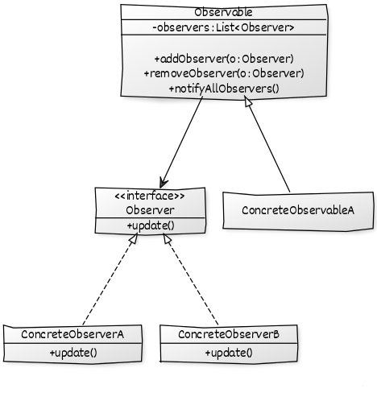

- **Observer:** Değişimden etkilenecek, izleyecek olan sınıfların uyguladığı arayüzdür. Duruma göre soyut sınıf (abstract class) da olabilir.

- **ConcreteObserver:** Observer arayüzünü uygulayan, değişimi takip eden sınıflardır. Değişim `update` metotu ile bildirilir. 

- **Observable:** Takip edilecek olan yapımızdır. İçerisinde `Observer` (değişimden etkilenecek) nesneleri tutar.

- **ConcreteObservable:** `Observer` sınıfından türerler.

Senaryo olarak kullanıcılarımızın olduğunu ve bu kullanıcıların fiyatını takip ettiği bir ürün olduğunu farz edelim. Ürün fiyatı değiştikten sonra takip eden kullanıcılara bir mesaj gittiğini düşünelim.

C# Kod Örneği:

```csharp
// Değişimden etkilenecek, izleyecek olan sınıfların uyguladığı arayüzdür.
// UML diyagramındaki Observer yapısına denk gelmektedir.
interface IObserverUser
{
    void SendNotification(ProductUpdateMessage message);
}
```

```csharp
// Observer arayüzünü uygulayan, değişimi takip eden sınıflardır.
// Değişim update metotu ile bildirilir.
// UML diyagramındaki ConcreteObserver yapısına denk gelmektedir.
class ObserverUser : IObserverUser
{
    public void SendNotification(ProductUpdateMessage message)
    {
        Console.WriteLine(message.ToString());
    }
}
```

```csharp
// Bildirilecek olan nesnelere paremetre olarak giden mesaj.
// UML diyagramı ile ilgisi yoktur.
class ProductUpdateMessage
{
    public string productName;
    public string message;

    public override string ToString()
    {
        return $"{productName} updated. Message: {message}";
    }
}
```

```csharp

// Takip edilecek olan yapımızdır.
// İçerisinde Observer (değişimden etkilenecek) nesneleri tutar.
// UML diyagramındaki Observable yapısına denk gelmektedir.
abstract class ObservableProduct
{
    private List<IObserverUser> _users;
    protected ProductUpdateMessage message;

    public ObservableProduct()
    {
        _users = new List<IObserverUser>();
        message = new ProductUpdateMessage();
    }

    public void AddObserver(IObserverUser observerUser)
    {
        _users.Add(observerUser);
    }

    public void RemoveObserver(IObserverUser observerUser)
    {
        _users.Remove(observerUser);
    }

    public void NotifyObserver()
    {
        foreach (IObserverUser user in _users)
        {
            user.SendNotification(message);
        }
    }
}
```

```csharp
// Observer sınıfından türer.
// UML diyagramındaki ConcreteObservable yapısına denk gelmektedir.
class Samsung : ObservableProduct
{
    // Ürün fiyatı değiştikten sonra Observer örneklerine bildirim gönderilir.
    public void ChangePrice()
    {
        // Ürün fiyatlarının güncellenmesi vs.

        this.message.productName = "Samsung";
        this.message.message = "Samsung's price updated.";
        this.NotifyObserver();
    }
}
```

```csharp
// Güncellemeden etkilenecek olan sınıf örnekleri.
IObserverUser mehmet = new ObserverUser();
IObserverUser derya = new ObserverUser();
IObserverUser sema = new ObserverUser();
IObserverUser aleyna = new ObserverUser();


// İzlenecek olan sınıf örneği.
Samsung samsung = new Samsung();

// İzlenecek olan sınıfa etkilenecek olan nesnelerin atanması.
samsung.AddObserver(mehmet);
samsung.AddObserver(derya);
samsung.AddObserver(sema);
samsung.AddObserver(aleyna);

samsung.ChangePrice();

// output:
//  Samsung updated. Message: Samsung's price updated.
//  Samsung updated. Message: Samsung's price updated.
//  Samsung updated. Message: Samsung's price updated.
//  Samsung updated. Message: Samsung's price updated.
```

*Bu tasarım deseninin JAVA ve diğer diller için olan uygulamasını [bu tasarım deseni için oluşturulmuş klasörde](https://github.com/yusufyilmazfr/tasarim-desenleri-turkce-kaynak/tree/master/observer) bulabilirsiniz.*

#### 🤔 State

> State tasarım deseni, bir nesnenin iç durumu değiştiğinde meydana gelecek değişimler sonrası çalışma zamanında dinamik olarak farklı davranışları sergileyebilmesini sağlayan bir tasarım desenidir.

State tasarım desenini **biçimsel diller ve otomatalar, durum makinaları** ile de ifade edilebilmektedir. Otomatalarda da olduğu gibi kodlarımızda da durumlar söz konusudur. Bir durumunda başka bir duruma gitmek, orada tekrar etmek ya da geriye dönmek gibi durumlarımız ve bu durumları gerçekleştirirken ki davranışlarımız mevcuttur.

Yazılım tarafından olaya baktığımızda aslında state diagramları ile ifade edilebilen her nesne için state deseninin uygulanabileceğini düşünebiliriz. Örneğin uygulamanın çalıştığı makinenin bellek durumları state kalıbına uygun olarak tasarlanabilir. Makinenin normal seviyede olması, sistem kaynaklarının çok tüketilmesi sonucu alarm haline geçmesi veya alarm verilmeden önce uyarı moduna geçmesi söz konusu olabilir. Bu durumlar arasındaki geçişler aslında bilgisayarın bazı iç değerlerine göre gerçeklenir. Memory, CPU, Running Process ölçümleri birer kriter olabilir ve örneğin Computer isimli bir nesnenin iç durumunu ifade edebilir.

Bu aşamada, bundan sonra **internal state'** i taşıyan yani davranışı değişecek olan nesneye **Context** dediğimizi düşünelim. Birden fazla davranış ve doğal olarak durum olabileceğinden, **Context'** in farklı durumlara erişebilip aralardaki **geçişleri(Transitions)** sağlayabilmesi gerekir. Bu durumda, **Context** tipinin tüm durumlar için ortak bir arayüz sunan başka bir tip ile *(buna State diyebiliriz)*  **Aggregation** ilişkisini sağlaması uygundur.

**State** tipinin kendisi aslında, **Context** tipinin belli bir durumu ile ilişkilendirilmiş davranışların kapsüllenmesi için bir arayüz sunmaktadır. Bu arayüz sunumu **aslı durum tipleri(Concrete State)** tarafından değerlendirilebilir. Bu tanımlar doğrultusunda bu tasarım desenine ait UML diyagramı aşağıdaki gibi olacaktır.

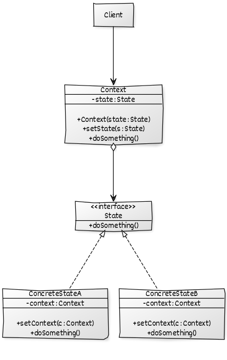

- **State:** Davranışın/olayın tanımlandığı arayüzdür, soyut sınıf da olabilmektedir. 

- **ConcreteState:**  `State` arayüzünü uygular, bu sayede farklı durumlar meydana gelir.

- **Context:** Durumu izlenecek olan nesnedir.

Senaryol olarak yiyecek otomatları düşünülebilir. Bu otomatlar için sıralı durumlar mevcuttur. Bunlar; 

1. Ön hazırlıkların yapılması durumu => **InitializeState**

2. Bekleme durumu => **WaitingState**

3. Ürünün hazırlanması durumu => **PreparingState**

4. Ürünün teslim edilmesi durumu => **DeliveryState**

C# Kod Örneği:

```csharp
// Davranışların tanımlandığı soyut sınıftır.
// UML diyagramındaki State yapısına denk gelmektedir.
public abstract class VendingMachineState
{
    public abstract void HandleState(VendingMachine context);
}
```

```csharp
// Farklı durumların meydana geldiği sınıf.
// UML diyagramındaki State (VendingMachineState) yapısından türer.
// UML diyagramındaki ConcreteState yapısına denk gelmektedir.
class InitializeState : VendingMachineState
{
    // Başlangıç durumu ayarları yapıldıktan sonra WaitingState (hazır) durumuna geçer.
    public override void HandleState(VendingMachine context)
    {
        Console.WriteLine("InitializeState: Ön hazırlıklar yapılıyor.");

        context.SetState(new WaitingState());
    }
}
```

```csharp
// Farklı durumların meydana geldiği sınıf.
// UML diyagramındaki State (VendingMachineState) yapısından türer.
// UML diyagramındaki ConcreteState yapısına denk gelmektedir.
class WaitingState : VendingMachineState
{
    // WaitingState durumunda herhangi bir yeni duruma geçmeye gerek yok.
    // Buradan sonraki durum gelen istek ile aksiyon alacaktır.
    public override void HandleState(VendingMachine context)
    {
        Console.WriteLine("WaitingState: Otomata herhangi bir aksiyon bekliyor.");
    }
}
```

```csharp
// Farklı durumların meydana geldiği sınıf.
// UML diyagramındaki State (VendingMachineState) yapısından türer.
// UML diyagramındaki ConcreteState yapısına denk gelmektedir.
class PreparingState : VendingMachineState
{
    // PreparingState durumunda ürün hazırlanması gibi işlemler yapılmaktadır.
    // Buradan sonraki durum ise ürünün verilmesi durumudur. (DeliveryState) 
    public override void HandleState(VendingMachine context)
    {
        Console.WriteLine("PreparingState: İstenilen ürün hazırlanıyor. Lütfen bekleyiniz");

        context.SetState(new DeliveryState());
    }
}
```

```csharp
// Farklı durumların meydana geldiği sınıf.
// UML diyagramındaki State (VendingMachineState) yapısından türer.
// UML diyagramındaki ConcreteState yapısına denk gelmektedir.
class DeliveryState : VendingMachineState
{
    // DeliveryState durumunda otomatadan ürünün teslim işlemleri yapılmaktadır.
    // Ürün verildikten sonra başlangıç, bekleme durumuna geçmektedir. (WaitingState)
    public override void HandleState(VendingMachine context)
    {
        Console.WriteLine("DeliveryState: Ürün teslim ediliyor.");

        context.SetState(new WaitingState());
    }
}
```

```csharp
// Durumu izlenecek olan sınıftır.
// UML diyagramındaki Context yapısına denk gelmektedir.
public class VendingMachine
{
    private VendingMachineState _state;

    // Otomata örneği oluştuğu zaman başlangıç durumuna geçiyor.
    public VendingMachine()
    {
        SetState(new InitializeState());
    }

    public void SetState(VendingMachineState state)
    {
        _state = state;
        _state.HandleState(this);
    }

    public void RequestProduct(string productName, double price)
    {
        // Burada ürünlere ait iş kodları olacaktır.
        // Ürün kontrolü, fiyatlandırma gibi kontroller.
        // Ürün ve fiyat olarak bir problemin olmadığı var sayılsın.

        SetState(new PreparingState());
    }
}
```

```csharp
VendingMachine vendingMachine = new VendingMachine();
vendingMachine.RequestProduct("COVID-19 MASKE", 2);

// output:
//  InitializeState: Ön hazırlıklar yapılıyor.
//  WaitingState: Otomata herhangi bir aksiyon bekliyor.
//  PreparingState: İstenilen ürün hazırlanıyor.Lütfen bekleyiniz
//  DeliveryState: Ürün teslim ediliyor.
//  WaitingState: Otomata herhangi bir aksiyon bekliyor.
```

*Bu tasarım deseninin JAVA ve diğer diller için olan uygulamasını [bu tasarım deseni için oluşturulmuş klasörde](https://github.com/yusufyilmazfr/tasarim-desenleri-turkce-kaynak/tree/master/state) bulabilirsiniz.*

#### 💪 Strategy

> Strategy tasarım deseni, bir algoritma ailesi tanımlamamızı, her birini ayrı bir sınıfa koymamızı ve nesnelerinin birbiriyle değiştirilebilir hale getirmenizi sağlayan davranışsal bir tasarım modelidir.

Bir işlemin birden fazla yapılması, çalışma zamanında algoritma değişikliği gibi durumlarda kullanılır, karışık if-else durumundan da kurtarır. Soyutlamadan dolayı da `Loosely Coupled` bir uygulama halini alır.

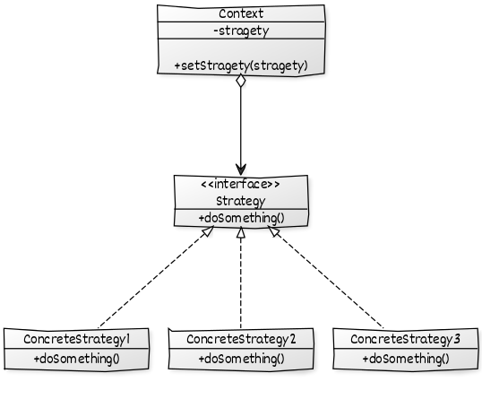

Senaryo olarak e-ticaret projesinin ödeme kısmını düşünelim. Ödeme metotları arasında; kredi kartı, Paypal gibi seçenekler mevcuttur. 

C# Kod Örneği:

```csharp
// UML diyagramındaki Strategy arayüzüne denk gelmektedir.
// Benzer işlemleri yapan sınıflar bu arayüzden türeyecektir.
interface IPayment
{
    void Pay(int amount);
}
```

```csharp
// UML diyagramındaki ConcreteStrategy sınıfına denk gelmektedir.
// UML diyagramındaki Strategy arayüzüne denk gelen arayüzü uyguluyor.
class PaypalPayment : IPayment
{
    private string _email;
    private string _password;

    public PaypalPayment(string email, string password)
    {
        _email = email;
        _password = password;
    }

    public void Pay(int amount)
    {
        // Kredi kartı ödeme işlemlerinin gerçekleştiği yer.
        Console.WriteLine("Paid by Paypal.");
    }
}
```

```csharp
// UML diyagramındaki ConcreteStrategy sınıfına denk gelmektedir.
// UML diyagramındaki Strategy arayüzüne denk gelen arayüzü uyguluyor.
class CreditCartPayment : IPayment
{
    private string _name;
    private string _cardNumber;
    private string _cvv;
    private string _dateOfExpiry;

    public CreditCartPayment(string name, string ccNum, string cvv, string expiryDate)

    {
        _name = name;
        _cardNumber = ccNum;
        _cvv = cvv;
        _dateOfExpiry = expiryDate;
    }

    public void Pay(int amount)
    {
        // Kredi kartı ödeme işlemlerinin gerçekleştiği yer.
        Console.WriteLine("Paid by credit cart.");
    }
}
```

```csharp
// Sepette bulunan ürünleri temsil eden sınıf.
// Ürün kodu ve fiyat bilgisi temel olarak yeterlidir.
class Item
{
    private string _upcCode;
    private int _price;

    public Item(string upcCode, int price)
    {
        _upcCode = upcCode;
        _price = price;
    }

    public int GetPrice()
    {
        return _price;
    }
}
```

```csharp
// UML diyagramındaki Context sınıfına denk gelmektedir.
// UML diyagramındaki Strategy(IPayment) arayüzüne ait referansı tutmaktadır.
class ShoppingCart
{
    private List<Item> _items;
    private IPayment _payment;

    public ShoppingCart()
    {
        _items = new List<Item>();
    }

    public void SetPaymentMethod(IPayment payment)
    {
        _payment = payment;
    }

    public void AddItem(Item item)
    {
        _items.Add(item);
    }

    public int CalculateTotal()
    {
        int sum = 0;
        foreach (Item item in _items)
        {
            sum += item.GetPrice();
        }
        return sum;
    }

    public void Pay()
    {
        int amount = CalculateTotal();
        _payment.Pay(amount);
    }
}
```

```csharp
ShoppingCart shoppingCart = new ShoppingCart();
shoppingCart.AddItem(new Item("894651364", 80));
shoppingCart.AddItem(new Item("654798243", 20));

shoppingCart.SetPaymentMethod(new PaypalPayment("yusufyilmazfr@gmail.com", "examplepassword"));
shoppingCart.Pay(); // output: Paid by Paypal.


shoppingCart.SetPaymentMethod(new CreditCartPayment("Julia Rodriguez", "4373093149845972", "199", "12/2024"));
shoppingCart.Pay(); // output: Paid by credit cart.
```

*Bu tasarım deseninin JAVA ve diğer diller için olan uygulamasını [bu tasarım deseni için oluşturulmuş klasörde](https://github.com/yusufyilmazfr/tasarim-desenleri-turkce-kaynak/tree/master/strategy) bulabilirsiniz.*

#### 📥 Template Method

> Template Method tasarım deseni, üst sınıflarda bir algoritma iskeleti tanımlamamızı ve alt sınıfların algoritma iskeleti yapısını bozmadan belirli adımları yeniden tanımlamasını (override) sağlayan tasarım desenidir.

Yazdığımız metotun (ki buradaki metot uml diyagramındaki `TemplateMetot` oluyor) davranışı, içerisindeki adımları  bazı durumlara göre farklılık gösterebilmektedir. Bu farklılıkları sağlayan adımları, metotları soyutlarayak bir alt sınıfın kendince uyarlamasını sağlamaya yarar bu tasarım deseni. 

Aşağıda bu tasarım desenine ait UML diyagramı bulunmaktadır.

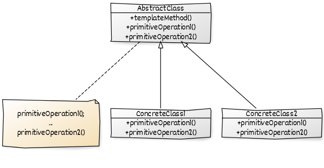

- **AbstractClass:** Alt sınıfların uygulaması için oluşturulmuştur, metot iskeletimizi ve soyutlanmış diğer metotları içerir. Soyut sınıfımızdır, arayüz de olabilir. 

- **ConcreteClasss:** `AbstractClass` sınıfından türer. Soyutlanmış metotları kendince tanımlanmasını sağlar.

Senaryo olarak geçen haftanın verilerinin analizinin yapılıp en sonda da bizlere bir çıktı, rapor verilğini düşünelim. Burada rapor verme süreçleri farklılık gösterebilir. Örneğin; XML formatında da bir rapor hazırlanabilir ya da HTML formatında da.

C# Kod Örneği:

```csharp
// Metot iskeletimizi ve soyutlanmış metotları içermektedir.
// UML diyagramındaki AbstractClass yapısına denk gelmektedir.
abstract class DataAnalyzerBase
{
    // Metot iskeletimiz.
    public void AnalyzeDataOfLastWeek()
    {
        object data = GetDataOfLastWeek();
        object result = AnalyzeData(data);
        ExportResult(result);
    }

    private object GetDataOfLastWeek()
    {
        // Burada veri verinin çağrılma süreçleri yer alacaktır.
        // Default olarak bir obje dönülmektedir.
        Console.WriteLine("Method worked: GetDataOfLastWeek");
        return new object();
    }

    private object AnalyzeData(object data)
    {
        // Burada verinin analizi süreci yer almaktadır.
        // Analiz sonuçları default olarak bir obje dönmektedir.
        Console.WriteLine("Method worked: AnalyzeData");
        return new object();
    }

    // Alt sınıflar tarafından uygulanmasını istediğimiz metottur.
    // Metot iskeleti içerisinde farklılık gösterecek olan metotumuzdur.
    public abstract void ExportResult(object result);
```

```csharp
// UML diyagramındaki AbstractClass (DataAnalyzerBase) sınıfından türer.
// UML diyagramındaki ConcreteClass yapısına denk gelmektedir.
class HtmlDataAnalyzer : DataAnalyzerBase
{
    public override void ExportResult(object result)
    {
        // Durumun HTML'e dönüştürülmesi işlemleri yer alacaktır.
        Console.WriteLine("HTML exported.");
    }
}
```

```csharp
// UML diyagramındaki AbstractClass (DataAnalyzerBase) sınıfından türer.
// UML diyagramındaki ConcreteClass yapısına denk gelmektedir.
class XmlDataAnalyzer : DataAnalyzerBase
{
    public override void ExportResult(object result)
    {
        // Durumun XML'e dönüştürülmesi işlemleri yer alacaktır.
        Console.WriteLine("XML exported.");
    }
}
```

```csharp
DataAnalyzerBase dataAnalyzer;

dataAnalyzer = new XmlDataAnalyzer();
dataAnalyzer.AnalyzeDataOfLastWeek();
// output:
//  Method worked: GetDataOfLastWeek
//  Method worked: AnalyzeData
//  XML exported.

dataAnalyzer = new HtmlDataAnalyzer();
dataAnalyzer.AnalyzeDataOfLastWeek();
// output:

//  Method worked: GetDataOfLastWeek
//  Method worked: AnalyzeData
//  HTML exported.
```

*Bu tasarım deseninin JAVA ve diğer diller için olan uygulamasını [bu tasarım deseni için oluşturulmuş klasörde](https://github.com/yusufyilmazfr/tasarim-desenleri-turkce-kaynak/tree/master/template-method) bulabilirsiniz.*

#### 🏃‍♀️ Visitor

> Visitor tasarım deseni, üzerinde çalıştığımız nesnelerin sınıflarını değiştirmeden yeni bir özellik tanımlamamızı sağlayan bir tasarım desenidir.

İşlem yapılacak nesnelerde herhangi bir değişiklik yapılmaz. İşlemi ziyaretçi (Visitor) nesneleri yapar. Eğer sisteme yeni nesneler eklenmiyor, fakat sık sık yeni işlemlerin eklenmesi gerekiyorsa bu tasarım deseni kullanılabilir. Bu tasarım deseninin kullanılmasıyla, yapılacak işlemle ilgili kodların merkezi bir nesnede toplanır.

Bu tasarım desenine ait UML diyagramı aşağıdaki gibidir.

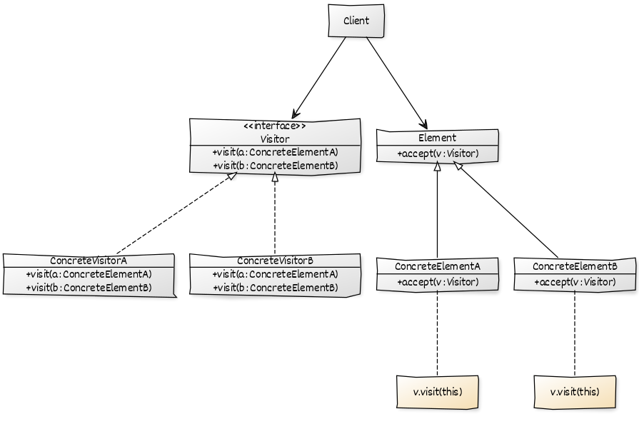

- **Visitor:** Her `ConcreteVisitor` örneği için metot temsil eder, parametre olarak `Element ` sınıfından türeyen sınıfların örneğini alır. 

- **ConcreteVisitor:** `Visitor` arayüzünü ve burada tanımlı olan metotları uygular. Sonradan eklenmek istenen işlemler burada yer alır.

- **Element:** `ConcreteElement`  sınıfı örneklerinin ortak bir parametre olarak gitmesi için yapılan soyutlamadır.

- **ConcreteElement:** `Element` sınıfından türer. `accept` metoduna bulunduğu nesne örneği gönderilir.

Senaryo olarak elimizde kitaplarımızın olduğunu ve bu kitap bilgilerinin farklı şekillerde XML ya da JSON gibi çıktılarının alındığını düşünelim.

C# Kod Örneği:

```csharp
// Temel sınıftır.
// Yeni davranışları Accept metotu ile alır.
// UML diyagramındaki Element yapısına denk gelmektedir.
abstract class Book
{
    public string name;
    public string author;
    public string categoryName;

    public abstract void Accept(IBookExportVisitor visitor);
}
```

```csharp
// UML diyagramındaki Element'ten türer.
// Accept metoduna bulunduğu nesne örneği gönderilir.
// UML diyagramındaki ConcreteElement yapısına denk gelir.
class Encyclopedia : Book
{
    public override void Accept(IBookExportVisitor visitor)
    {
        visitor.ExportVisit(this);
    }
}
```

```csharp
// UML diyagramındaki Element'ten türer.
// Accept metoduna bulunduğu nesne örneği gönderilir.
// UML diyagramındaki ConcreteElement yapısına denk gelir.
class Magazine : Book
{
    public override void Accept(IBookExportVisitor visitor)
    {
        visitor.ExportVisit(this);
    }
}
```

```csharp
// Her ConcreteVisitor örneği için metot temsil eder.
// Parametre olarak Element sınıfından türeyen sınıfların örneğini alır.
// UML diyagramındaki Visitor yapısına denk gelir.
interface IBookExportVisitor
{
    void ExportVisit(Magazine magazine);
    void ExportVisit(Encyclopedia encyclopedia);
}
```

```csharp
// Visitor arayüzünü ve burada tanımlı olan metotları uygular.
// Sonradan eklenmek istenen işlemler burada yer alır.
// UML diyagramındaki ConcreteVisitor yapısına denk gelir.
class XmlExportVisitor : IBookExportVisitor
{
    public void ExportVisit(Magazine magazine)
    {
        // Parametre olarak gelen örneğin XML'e çevrilmesi işlemleri yer alacaktır.
        Console.WriteLine($"{magazine.name} exported by XmlExportVisitor");
    }

    public void ExportVisit(Encyclopedia encyclopedia)
    {
        // Parametre olarak gelen örneğin XML'e çevrilmesi işlemleri yer alacaktır.
        Console.WriteLine($"{encyclopedia.name} exported by XmlExportVisitor");
    }
}
```

```csharp
// Visitor arayüzünü ve burada tanımlı olan metotları uygular.
// Sonradan eklenmek istenen işlemler burada yer alır.
// UML diyagramındaki ConcreteVisitor yapısına denk gelir.
class JsonExportVisitor : IBookExportVisitor
{
    public void ExportVisit(Magazine magazine)
    {
        // Parametre olarak gelen örneğin JSON'a çevrilmesi işlemleri yer alacaktır.
        Console.WriteLine($"{magazine.name} exported by JsonExportVisitor");
    }

    public void ExportVisit(Encyclopedia encyclopedia)
    {
        // Parametre olarak gelen örneğin JSON'a çevrilmesi işlemleri yer alacaktır.
        Console.WriteLine($"{encyclopedia.name} exported by JsonExportVisitor");
    }
}
```

```csharp
Book earth = new Encyclopedia();

earth.name = "Big Earth!";
earth.author = "Jose S. Massey";
earth.categoryName = "Encyclopedia";

Book daily = new Magazine();

daily.name = "Daily Magazine";
daily.author = "Wayne D. Eakin";
daily.categoryName = "Magazine";


IBookExportVisitor xmlExportVisitor = new XmlExportVisitor();
IBookExportVisitor jsonExportVisitor = new JsonExportVisitor();

earth.Accept(xmlExportVisitor);
daily.Accept(jsonExportVisitor);

// output:
//  Big Earth!exported by XmlExportVisitor
//  Daily Magazine exported by XmlExportVisitor
```

*Bu tasarım deseninin JAVA ve diğer diller için olan uygulamasını [bu tasarım deseni için oluşturulmuş klasörde](https://github.com/yusufyilmazfr/tasarim-desenleri-turkce-kaynak/tree/master/visitor) bulabilirsiniz.*

# Kapanış

**Design Patterns: Elements of Reusable Object-Oriented Software** kitabındaki temel 23 tasarım deseninin konu anlatımı ve birçok dilde olan uygulamalarını bitirdik. Kaynak üzerinde yanlış olan, düzeltilmesini istediğiniz yerleri [GitHub]([https://github.com/yusufyilmazfr/tasarim-desenleri-turkce-kaynak](https://github.com/yusufyilmazfr/tasarim-desenleri-turkce-kaynak) hesabı üzerinden pull request atarak sizler de kaynağa katkıda bulunabilirsiniz.

Bu kaynak [Yusuf Yılmaz](https://github.com/yusufyilmazfr/) tarafından hazırlanmıştır. Bu kaynağın en güncel PDF ve konu örneklerine [https://github.com/yusufyilmazfr/tasarim-desenleri-turkce-kaynak](https://github.com/yusufyilmazfr/tasarim-desenleri-turkce-kaynak) üzerinden erişebilirsiniz.

*Bu kaynağı, COVID-19 ile mücadele ettiği için aylardır göremediğim sevgili ablama ve değerli aileme adıyorum. Nice güzel günlere.*

# Kaynakçalar

- [Java Design Patterns - A Tour with 23 Gang of Four Design Patterns in Java](https://www.amazon.com/Java-Design-Patterns-Vaskaran-Sarcar/dp/1484218019)
- [https://www.journaldev.com/1754/strategy-design-pattern-in-java-example-tutorial](https://www.journaldev.com/1754/strategy-design-pattern-in-java-example-tutorial)
- [https://springframework.guru/gang-of-four-design-patterns/bridge-pattern/](https://springframework.guru/gang-of-four-design-patterns/bridge-pattern/)
- [http://www.borakasmer.com/memento-design-pattern/](http://www.borakasmer.com/memento-design-pattern/)
- [https://tr.wikipedia.org/wiki/Nesne_y%C3%B6nelimli_programlama](https://tr.wikipedia.org/wiki/Nesne_y%C3%B6nelimli_programlama)
- [https://tr.wikipedia.org/wiki/%C3%87ok_bi%C3%A7imlilik](https://tr.wikipedia.org/wiki/%C3%87ok_bi%C3%A7imlilik)
- [https://tr.wikipedia.org/wiki/Kaps%C3%BClleme](https://tr.wikipedia.org/wiki/Kaps%C3%BClleme)
- [https://medium.com/@atarikguney/abstraction-ve-encapsulation-tam-olarak-nedir-27b9aae99e56](https://medium.com/@atarikguney/abstraction-ve-encapsulation-tam-olarak-nedir-27b9aae99e56)
- [Engin Demiroğ, Canlı Yayın - SOLID Yazılım Geliştirme Prensipleri](https://www.youtube.com/watch?v=JldZhDSvBBQ)
- [https://www.gencayyildiz.com/blog/c-abstract-factory-design-patternabstract-factory-tasarim-deseni/](https://www.gencayyildiz.com/blog/c-abstract-factory-design-patternabstract-factory-tasarim-deseni/)
- [https://www.gencayyildiz.com/blog/c-prototype-design-pattern-prototip-tasarim-deseni/](https://www.gencayyildiz.com/blog/c-prototype-design-pattern-prototip-tasarim-deseni/)
- [https://www.buraksenyurt.com/post/Tasarc4b1m-Desenleri-State](https://www.buraksenyurt.com/post/Tasarc4b1m-Desenleri-State)
- [https://www.buraksenyurt.com/post/Tasarc4b1m-Desenleri-Interpreter](https://www.buraksenyurt.com/post/Tasarc4b1m-Desenleri-Interpreter)
